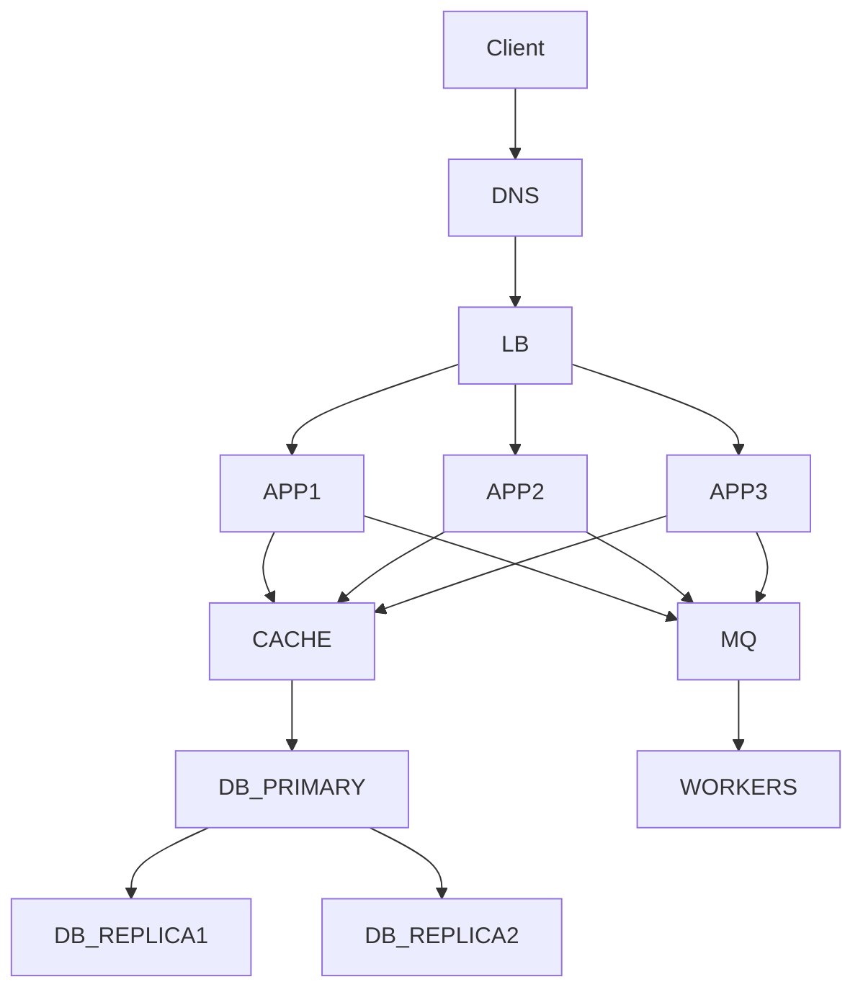
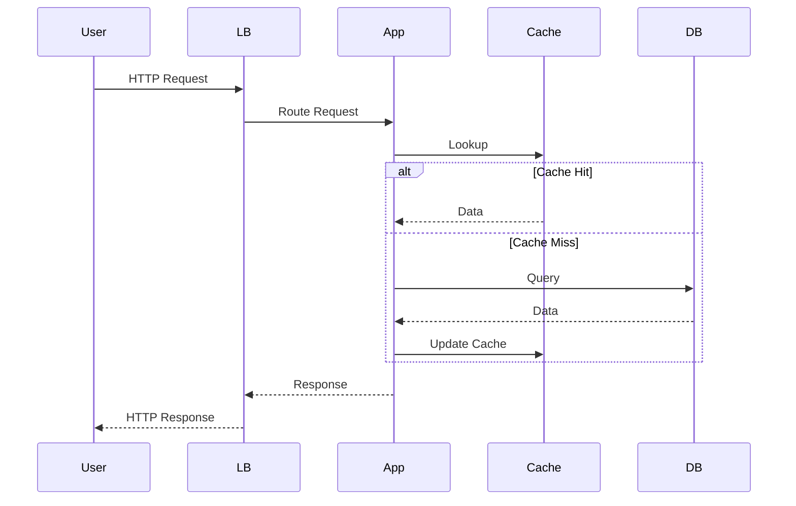
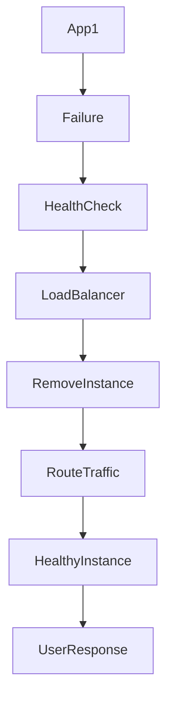

# Chapter 1: High Availability (Part 1)

> **Part I – System Design Foundations**

---

# High Availability

| Attribute        | Value                              |
| ---------------- | ---------------------------------- |
| **Version**      | 1.0                                |
| **Part**         | Part I – System Design Foundations |
| **Chapter**      | 1                                  |
| **Reading Time** | ~90–120 Minutes                    |
| **Difficulty**   | Intermediate → Advanced            |
| **Last Updated** | July 2026                          |

---

> [!NOTE]
> High Availability is one of the most fundamental quality attributes in enterprise architecture. Every organization that provides digital services—whether an online retailer, a banking platform, a healthcare system, or a video streaming service—expects its systems to remain operational despite failures. This chapter explores the architectural reasoning behind High Availability, the business problems it solves, and the trade-offs architects evaluate when designing resilient systems.

---

# Table of Contents

* Learning Objectives
* Prerequisites
* Terminology
* Opening Business Story
* Introduction
* Definition
* Business Goals
* Why High Availability Matters
* Quality Attribute Flow
* Business Impact
* Failure Modes
* Architecture Decisions
* Mechanisms
* Decision Matrix
* Trade-offs
* Measurements
* Operational Considerations
* Production Incidents
* Anti-patterns
* Resource Impact Analysis
* Enterprise Maturity Model
* Architecture Evolution
* Architecture Review Checklist
* Production Readiness Checklist
* Architecture Decision Record (ADR)
* Architecture Thinking Tips
* Architect's Mental Model
* Enterprise Examples
* Architecture Diagrams
* Interview Preparation
* Best Practices
* Related Concepts
* Further Reading
* Revision Notes
* Chapter Completion Checklist
* Architect's Questions

---

# Learning Objectives

After completing this chapter, you should be able to:

* Explain High Availability from a business perspective rather than a purely technical perspective.
* Understand why organizations invest heavily in availability.
* Distinguish High Availability from Reliability, Fault Tolerance, Disaster Recovery, and Scalability.
* Identify common causes of downtime in distributed systems.
* Evaluate architectural decisions that improve availability.
* Analyze trade-offs between cost, complexity, consistency, and availability.
* Design systems that continue serving users despite component failures.
* Measure availability using industry-standard metrics and Service Level Objectives (SLOs).
* Conduct architecture reviews focused on availability risks.
* Communicate availability decisions effectively to both business stakeholders and engineering teams.

---

# Prerequisites

## Required Knowledge

Readers should already be comfortable with:

* Client–Server Architecture
* HTTP and REST APIs
* Basic Networking Concepts
* Databases
* Caching Fundamentals
* Load Balancing Basics
* Virtual Machines and Containers

---

## Recommended Knowledge

The following topics are helpful but not mandatory:

* Distributed Systems Fundamentals
* Cloud Computing
* Kubernetes
* Messaging Systems
* CAP Theorem
* Microservices
* Observability

---

## Previous Chapters

None.

This is the first chapter of the handbook.

---

## Next Chapters

* Reliability
* Scalability
* Fault Tolerance
* Disaster Recovery
* Load Balancing
* Distributed Systems Fundamentals

---

# Terminology

| Term                           | Definition                                                    |
| ------------------------------ | ------------------------------------------------------------- |
| Availability                   | Ability of a system to remain operational when users need it. |
| Downtime                       | Period during which a service is unavailable.                 |
| Uptime                         | Time during which a service operates correctly.               |
| SLA                            | Service Level Agreement between provider and customer.        |
| SLO                            | Internal availability target.                                 |
| SLI                            | Measured indicator used to evaluate SLO compliance.           |
| MTTR                           | Mean Time To Recovery.                                        |
| MTBF                           | Mean Time Between Failures.                                   |
| Redundancy                     | Multiple components providing the same capability.            |
| Failover                       | Automatic transition to a backup component.                   |
| Replica                        | Copy of a service or database used for resilience.            |
| Single Point of Failure (SPOF) | A component whose failure causes complete service outage.     |
| Health Check                   | Mechanism to verify component health.                         |
| Active-Active                  | Multiple active instances serving traffic simultaneously.     |
| Active-Passive                 | Backup instance activated only during failure.                |
| Rolling Deployment             | Updating instances incrementally to reduce downtime.          |

---

# Opening Business Story

It is **11:58 PM** on the biggest shopping day of the year.

Millions of customers are waiting for a flash sale that begins exactly at midnight.

Marketing has invested millions in advertisements.

Operations teams have prepared warehouses.

Customer support has scheduled additional staff.

Business executives expect record-breaking revenue.

At **12:00 AM**, the sale starts.

Within seconds:

* Website traffic increases by 25×.
* Payment requests increase by 40×.
* Inventory services receive millions of updates.
* Recommendation engines process billions of requests.

Everything appears healthy.

Then a single database server crashes.

Although only one database instance failed, every application server depended on it.

The checkout service stops responding.

Shopping carts cannot be updated.

Payment processing halts.

Users begin refreshing their browsers repeatedly, creating even more traffic.

Within minutes:

* Social media fills with complaints.
* Thousands of customers abandon purchases.
* Customer support phone lines become overloaded.
* News outlets report the outage.
* Competitors benefit as frustrated customers switch platforms.

The hardware issue lasted only **seven minutes**.

The business impact lasted **several weeks**.

Marketing campaigns lost momentum.

Customer trust declined.

Future sales decreased because customers questioned the platform's reliability.

The company did not lose seven minutes.

It lost customer confidence.

---

This story illustrates a critical architectural principle:

> **Customers judge a business by its availability, not by the sophistication of its technology.**

A perfectly designed microservices architecture provides no value if customers cannot access it when they need it.

---

# Introduction

When people first learn software architecture, they often focus on technologies:

* Kubernetes
* Kafka
* Redis
* Docker
* Microservices
* Cloud Platforms

These technologies are important, but they are not architectural goals.

Architecture begins with business outcomes.

One of the earliest questions an architect asks is:

> **"What happens if this component fails?"**

This question is not driven by curiosity.

It is driven by business risk.

Every organization depends on digital services.

Examples include:

* Banks processing financial transactions.
* Airlines managing flight reservations.
* Hospitals accessing patient records.
* Streaming platforms delivering entertainment.
* Manufacturers operating production lines.
* Logistics companies tracking shipments.
* Government agencies delivering public services.

For these organizations, downtime is more than a technical inconvenience.

It directly affects:

* Revenue
* Customer satisfaction
* Regulatory compliance
* Operational efficiency
* Brand reputation
* Competitive advantage

Because failures are inevitable, architects do not attempt to eliminate failures.

Instead, they design systems that continue delivering business value despite failures.

This philosophy is the foundation of High Availability.

---

# Definition

## What is High Availability?

High Availability (HA) is the architectural capability of a system to remain operational and accessible to users despite failures of individual components.

The objective is **continuous service delivery**, even when hardware, software, networks, or entire infrastructure segments experience unexpected failures.

Availability does **not** mean failures never occur.

Failures are expected.

Availability measures how effectively the system continues operating while those failures occur.

---

## Why Does High Availability Exist?

Every digital business depends on continuous access to its services.

Without availability:

* Customers cannot purchase products.
* Payments cannot be processed.
* Employees cannot perform work.
* Supply chains become disrupted.
* Financial transactions fail.
* Critical healthcare operations may be delayed.

High Availability exists because **business operations cannot pause every time infrastructure fails**.

Failures are a certainty.

Business continuity is a choice.

---

## Purpose

The primary purpose of High Availability is to minimize service interruption while maintaining an acceptable customer experience.

Its goals include:

* Reducing downtime.
* Preventing single points of failure.
* Ensuring business continuity.
* Protecting customer trust.
* Meeting contractual service commitments.
* Supporting revenue-generating operations.

---

## First Principles

High Availability is based on several foundational principles:

### 1. Failures Are Inevitable

Every component eventually fails.

Examples include:

* Servers
* Databases
* Storage devices
* Networks
* Software
* Cloud services
* Human operations

Architects assume failure rather than hoping to avoid it.

---

### 2. Eliminate Single Points of Failure

If one component can stop the entire system, the architecture is inherently fragile.

Critical services require redundancy at every layer.

---

### 3. Detect Failures Quickly

Failures cannot always be prevented.

However, they must be detected immediately.

Rapid detection reduces recovery time and customer impact.

---

### 4. Recover Automatically

Manual intervention is too slow for modern digital platforms.

Systems should recover through automated mechanisms such as failover, self-healing, and traffic rerouting.

---

### 5. Minimize Customer Impact

The ultimate objective is not simply restoring infrastructure.

The objective is ensuring customers can continue using the service with minimal disruption.

---

# Business Goals

Technology investments require business justification.

High Availability is rarely implemented because engineers prefer resilient systems.

Organizations invest in it because it protects business outcomes.

## Customer Expectations

Modern users assume digital services are always available.

Examples include:

* Online banking accessible 24×7.
* Retail websites functioning during major sales.
* Video streaming without interruption.
* Food delivery platforms available at peak hours.
* Ride-sharing services responding instantly.
* Healthcare portals accessible during emergencies.

Customers no longer compare your service with direct competitors.

They compare it with the best digital experiences they use every day.

If a banking application experiences downtime while entertainment platforms remain continuously available, customer expectations shift accordingly.

The acceptable threshold for downtime continues to decrease across industries.

---

## Business Objectives

High Availability directly supports key business objectives:

* Protect revenue by preventing service interruptions.
* Maintain customer confidence.
* Fulfill contractual SLA commitments.
* Reduce operational disruption.
* Improve competitive positioning.
* Enable global, always-on operations.

Organizations that consistently deliver reliable services build long-term customer loyalty and reduce the hidden costs associated with outages, emergency recoveries, and reputational damage.

---

## 9. Why This Attribute Matters

High Availability is often misunderstood as a purely technical objective. Organizations do not invest in redundant servers, multiple data centers, or automated failover simply because these technologies are interesting. They invest because downtime directly affects revenue, customer trust, regulatory compliance, operational efficiency, and long-term business growth.

An architect should never ask:

> "How can we build a highly available system?"

Instead, the first question should be:

> "What is the business cost if this system becomes unavailable?"

The answer determines the level of availability that is economically justified.

---

### Availability Is a Business Decision

Different systems have different availability requirements.

A company payroll application that runs once every month has very different expectations than an online payment gateway processing thousands of transactions every second.

For example:

| System                    | Availability Requirement | Business Reason                                    |
| ------------------------- | ------------------------ | -------------------------------------------------- |
| Personal Blog             | Moderate                 | Temporary downtime has minimal impact.             |
| Internal HR Portal        | Medium                   | Employees may tolerate short outages.              |
| E-Commerce Website        | High                     | Every minute of downtime affects sales.            |
| Payment Gateway           | Very High                | Downtime directly prevents revenue generation.     |
| Hospital Emergency System | Critical                 | Human lives may depend on continuous operation.    |
| Air Traffic Control       | Mission Critical         | System failure can have catastrophic consequences. |

Architects must align availability targets with business value rather than striving for the highest possible availability in every case.

---

### Customer Impact

Customers expect digital services to be continuously available regardless of the underlying technical complexity.

A customer does not distinguish between:

* Database failures
* Network outages
* Kubernetes issues
* DNS problems
* Cloud provider incidents
* Deployment failures

From the customer's perspective, there are only two states:

```
Working

or

Not Working
```

When users encounter downtime, several consequences follow almost immediately:

* Transactions are abandoned.
* Users lose confidence.
* Customer support requests increase.
* Negative reviews appear on social media.
* Customers begin evaluating competitors.

Even brief outages can permanently influence customer perception.

---

### Business Impact

Availability directly affects nearly every business function.

#### Revenue Protection

For online businesses, downtime often means immediate revenue loss.

Examples:

* Customers cannot complete purchases.
* Subscription renewals fail.
* Advertisements cannot be displayed.
* Premium services become inaccessible.
* Payment processing stops.

Every unavailable minute may represent thousands—or millions—of dollars in lost revenue depending on the business scale.

---

#### Brand Reputation

Reputation takes years to build but only minutes to damage.

Highly visible outages often result in:

* News coverage
* Social media criticism
* Reduced customer confidence
* Investor concerns
* Increased customer churn

Organizations frequently recover technically much faster than they recover reputationally.

---

#### Customer Retention

Repeated outages influence customer behavior.

Customers may begin asking:

* Can I trust this platform?
* Will my payment succeed?
* Is my data safe?
* Should I switch to another provider?

Trust is difficult to regain once lost.

---

#### Competitive Advantage

Availability itself becomes a competitive differentiator.

If two platforms provide similar features, customers generally remain with the one that consistently works.

Reliability creates customer loyalty.

---

### Engineering Impact

Poor availability significantly increases engineering workload.

Frequent outages lead to:

* Emergency production calls
* Weekend deployments
* Incident investigations
* Manual recovery procedures
* Increased operational stress
* Delayed feature development

Engineering teams eventually spend more time fixing production issues than delivering new business capabilities.

High Availability improves engineering productivity by reducing operational interruptions.

---

### Financial Impact

Downtime generates costs that extend well beyond immediate revenue loss.

Typical financial consequences include:

| Area               | Financial Impact                              |
| ------------------ | --------------------------------------------- |
| Lost Sales         | Customers cannot purchase products.           |
| SLA Penalties      | Contractual payments to enterprise customers. |
| Customer Support   | Increased staffing requirements.              |
| Emergency Response | Overtime for engineering teams.               |
| Marketing          | Additional campaigns to rebuild trust.        |
| Legal Risk         | Potential regulatory penalties.               |

These indirect costs often exceed the direct revenue lost during the outage itself.

---

### Operational Impact

Operations teams rely heavily on service availability.

When critical systems become unavailable:

* Incident response teams are activated.
* Executives require frequent updates.
* Customer support volume increases dramatically.
* Manual business processes may be required.
* Planned releases are postponed.
* Engineering priorities shift toward recovery.

The organization experiences a ripple effect that extends far beyond the failed system.

---

## 10. Quality Attribute Flow

Architects rarely evaluate High Availability in isolation.

Instead, they examine how business objectives translate into architectural decisions.

The following flow illustrates this reasoning.

```text
Business Goal
      │
      ▼
Continuous Customer Service
      │
      ▼
Need High Availability
      │
      ▼
Identify Failure Risks
      │
      ▼
Design Architecture
      │
      ▼
Introduce Redundancy
      │
      ▼
Implement Failure Detection
      │
      ▼
Enable Automatic Recovery
      │
      ▼
Monitor Availability Metrics
      │
      ▼
Continuous Improvement
```

Let's examine each stage.

---

### Business Goal

Everything begins with a business objective.

Examples include:

* Sell products continuously.
* Process financial transactions.
* Provide uninterrupted healthcare services.
* Deliver media streaming globally.
* Support 24×7 logistics operations.

Availability is never the end goal—it supports these business outcomes.

---

### Quality Attribute

Once the business objective is understood, architects identify the required quality attributes.

Examples:

* Availability
* Reliability
* Scalability
* Security
* Performance

For this chapter, the primary focus is Availability.

---

### Business Impact

Architects then evaluate the consequences of downtime.

Questions include:

* How much revenue is lost per minute?
* What contractual obligations exist?
* What is the customer impact?
* Can manual processes temporarily replace automation?
* What level of outage is acceptable?

These answers determine the target availability.

---

### Failure Modes

Next, architects identify possible failures.

Typical failures include:

* Server crashes
* Network outages
* Database failures
* Region failures
* Human mistakes
* Software defects
* Dependency failures
* Configuration errors

Every important failure should have an associated mitigation strategy.

---

### Architecture Decisions

Only after understanding risks do architects make design decisions.

Examples:

* Deploy multiple application instances.
* Remove single points of failure.
* Use redundant databases.
* Introduce load balancers.
* Replicate data.
* Implement health checks.
* Automate failover.
* Separate failure domains.

Notice that these are architectural choices rather than technology selections.

---

### Mechanisms

Mechanisms are concrete implementations of architectural decisions.

Examples include:

* Load balancers
* Database replication
* Kubernetes self-healing
* Auto Scaling
* DNS failover
* Service discovery
* Distributed caching

Technology choices come last.

---

### Trade-offs

Every architectural decision introduces trade-offs.

Examples include:

| Decision                 | Benefit              | Trade-off                        |
| ------------------------ | -------------------- | -------------------------------- |
| Active-Active Deployment | Highest availability | Increased operational complexity |
| Multi-Region Deployment  | Regional resilience  | Higher infrastructure cost       |
| Automatic Failover       | Faster recovery      | More complex testing             |
| Data Replication         | Improved resilience  | Consistency challenges           |

Architects optimize—not maximize—availability.

---

### Measurements

Availability must be measurable.

Common metrics include:

* Availability Percentage
* Uptime
* MTTR
* MTBF
* Error Rate
* Failed Requests
* Recovery Time
* SLA Compliance

Without measurable objectives, availability cannot be effectively managed.

---

### Operations

High Availability is not achieved through architecture alone.

It requires continuous operational excellence through:

* Monitoring
* Alerting
* Incident response
* Capacity planning
* Backup validation
* Disaster recovery drills
* Chaos engineering
* Continuous improvement

Architecture provides the foundation, while operations sustain the outcome.

---

## 11. Business Impact

The impact of High Availability extends across every dimension of an enterprise. Understanding these effects helps architects justify investments in resilience and prioritize the systems that require the highest levels of protection.

### Positive Business Impact

A well-designed highly available system provides several strategic advantages.

#### Continuous Revenue Generation

Customers can complete transactions regardless of hardware failures, software defects, or localized infrastructure issues.

Examples include:

* Retail orders continue during peak sales.
* Banking transactions remain available.
* Subscription renewals succeed automatically.
* Digital advertising impressions are delivered without interruption.

Continuous availability directly supports continuous revenue.

---

#### Improved Customer Trust

Customers rarely notice a resilient architecture because the service simply works.

This consistency builds confidence over time and strengthens long-term relationships.

Trust becomes especially valuable in industries such as:

* Banking
* Healthcare
* Insurance
* Telecommunications
* Government services

---

#### Stronger Brand Reputation

Organizations known for reliable services often gain a competitive advantage.

Customers remember systems that consistently work during critical moments.

Examples:

* Shopping during holiday sales
* Paying bills before deadlines
* Booking travel during peak seasons
* Accessing emergency healthcare records

Availability becomes part of the brand promise.

---

#### Higher Customer Retention

Reliable systems reduce customer frustration and increase the likelihood of repeat business.

Existing customers are generally less expensive to retain than acquiring new ones, making availability an investment in customer lifetime value.

---

#### Better Operational Efficiency

Stable systems require fewer emergency interventions.

Engineering teams spend more time delivering new features and less time responding to incidents.

This improves overall organizational productivity.

---

### Negative Business Impact of Poor Availability

The absence of High Availability creates cascading consequences that extend far beyond the technical outage itself.

#### Immediate Revenue Loss

Every minute of downtime may prevent customers from:

* Placing orders
* Making payments
* Booking services
* Consuming digital content

The financial impact increases rapidly during periods of high demand.

#### Customer Churn

Repeated outages encourage customers to explore alternatives.

In highly competitive markets, switching costs are often low, making reliability a key factor in customer retention.

#### Regulatory and Contractual Risk

Organizations operating under strict service-level agreements or regulatory frameworks may incur penalties when availability targets are not met.

Examples include:

* Financial services
* Healthcare
* Government contracts
* Enterprise SaaS providers

#### Increased Operational Costs

Recovering from outages often requires:

* Emergency engineering effort
* Overtime pay
* Incident management
* Customer support escalation
* Post-incident analysis
* Infrastructure remediation

These costs are frequently overlooked during initial architecture planning.

---

### Key Performance Indicators (KPIs)

Business leaders often evaluate High Availability using measurable outcomes such as:

| KPI                          | Description                                                 |
| ---------------------------- | ----------------------------------------------------------- |
| Revenue During Peak Hours    | Ability to sustain business during demand spikes            |
| Order Completion Rate        | Percentage of initiated transactions successfully completed |
| Customer Retention Rate      | Long-term impact of service reliability                     |
| Customer Satisfaction (CSAT) | User perception of service quality                          |
| Net Promoter Score (NPS)     | Customer willingness to recommend the service               |
| SLA Compliance               | Percentage of contractual availability targets achieved     |
| Incident Frequency           | Number of service-impacting incidents over time             |
| Mean Time to Recovery (MTTR) | Average duration required to restore service                |

These metrics bridge the gap between technical architecture and business performance.

---

# 12. Failure Modes

High Availability is not achieved by assuming systems will never fail.

It is achieved by **assuming that failures are inevitable** and designing systems that continue delivering business value despite those failures.

One of the defining characteristics of experienced architects is that they spend considerable time asking:

> **"What can fail?"**

rather than

> **"What technology should we use?"**

Every production system eventually experiences failures.

Examples include:

* Hardware failures
* Software bugs
* Network outages
* Human mistakes
* Configuration errors
* Cloud provider incidents
* Resource exhaustion
* Unexpected traffic spikes
* Third-party service failures

Architects identify these risks early and design mitigation strategies before the system enters production.

---

## Failure Lifecycle

Every production failure typically follows a predictable lifecycle.

```text
Failure Occurs
      │
      ▼
Failure Detection
      │
      ▼
Impact Assessment
      │
      ▼
Traffic Isolation
      │
      ▼
Automatic Recovery
      │
      ▼
Service Restoration
      │
      ▼
Post-Incident Review
      │
      ▼
Architecture Improvements
```

A mature organization optimizes every stage of this lifecycle.

---

# 12.1 Network Failure

## Business Scenario

A payment service communicates with a fraud detection service over the network.

A network switch unexpectedly fails.

Although both services remain operational, they can no longer communicate.

Customers experience payment failures despite all application servers being healthy.

---

## Why It Happens

Common causes include:

* Router failure
* Switch failure
* Fiber cable damage
* Firewall misconfiguration
* DNS routing problems
* Cloud networking issues
* BGP routing incidents
* Packet loss
* High network latency

In distributed systems, **communication failures are far more common than application failures**.

---

## Symptoms

* Request timeouts
* Connection refused errors
* High latency
* Increased retries
* Service-to-service communication failures
* Growing request queues
* Partial functionality

---

## Detection

Typical monitoring includes:

* Network latency
* Packet loss percentage
* TCP connection failures
* HTTP timeout metrics
* Service mesh telemetry
* Distributed tracing
* Synthetic health checks

---

## Prevention

Architectural approaches include:

* Multiple network paths
* Redundant switches
* Multi-AZ deployment
* Service mesh with retries
* Intelligent timeout configuration
* Connection pooling
* Circuit breakers

---

## Recovery

Recovery strategies include:

* Route traffic through healthy paths.
* Fail over to another Availability Zone.
* Restart affected network devices.
* Automatically reroute traffic using load balancers.
* Isolate unhealthy services.

---

## Business Impact

Without redundancy:

* Checkout fails.
* Payments fail.
* Customer trust declines.
* Revenue decreases.

---

# 12.2 Region Failure

## Business Scenario

A cloud provider experiences a complete regional outage.

Every application instance is deployed in that single region.

The business becomes completely unavailable.

---

## Why It Happens

Possible causes include:

* Large-scale power failures
* Natural disasters
* Cloud infrastructure failures
* Regional networking outages
* Human operational mistakes
* Major software deployment failures

Although rare, regional failures have occurred across all major cloud providers.

---

## Symptoms

* Complete application outage
* Database unavailable
* Storage inaccessible
* DNS failures
* Authentication unavailable

---

## Detection

* Global monitoring
* Regional health checks
* External synthetic monitoring
* Multi-region heartbeat systems

---

## Prevention

Architectural options:

* Multi-region deployment
* Active-Active architecture
* Active-Passive architecture
* Cross-region database replication
* Global DNS failover

---

## Recovery

Typical recovery:

1. Detect regional outage.
2. Redirect traffic.
3. Promote secondary databases.
4. Resume traffic.
5. Verify data consistency.

---

## Business Impact

Organizations operating globally often measure outages in **millions of dollars per hour**.

---

# 12.3 Availability Zone (AZ) Failure

Availability Zones are designed to isolate localized infrastructure failures.

An entire AZ may become unavailable because of:

* Power failure
* Cooling failure
* Network isolation
* Internal cloud maintenance issues

---

## Prevention

Deploy application instances across multiple AZs.

Example:

```text
                Internet
                     │
                     ▼
            Load Balancer
           /             \
          ▼               ▼
      AZ-A             AZ-B
   App Servers      App Servers
        │               │
        └──────┬────────┘
               ▼
     Multi-AZ Database Cluster
```

If one AZ becomes unavailable, traffic automatically shifts to healthy instances.

---

# 12.4 DNS Failure

## Business Scenario

Users cannot reach the application because DNS resolution fails.

The application itself is healthy.

---

## Common Causes

* DNS provider outage
* Incorrect DNS records
* Expired domains
* Cache poisoning
* Misconfigured TTL

---

## Symptoms

* "Website not found"
* Name resolution timeout
* Intermittent connectivity

---

## Prevention

* Multiple DNS providers
* Low TTL values
* Global Anycast DNS
* Continuous DNS monitoring

---

## Business Impact

Customers perceive the entire platform as unavailable.

---

# 12.5 Database Failure

The database is frequently the most critical component in enterprise systems.

If every service depends on one database, it becomes a **Single Point of Failure (SPOF).**

---

## Common Causes

* Hardware failure
* Disk corruption
* Storage exhaustion
* Database software crash
* Network partition
* Replication failure
* Human error

---

## Symptoms

* Slow queries
* Connection failures
* Transaction failures
* Deadlocks
* Replication lag

---

## Prevention

* Database replication
* Automatic failover
* Read replicas
* Backup strategy
* Connection pooling
* Health monitoring

---

## Recovery

* Promote replica
* Restore from backup (if necessary)
* Redirect application connections
* Validate data integrity

---

## Business Impact

For transactional systems, database failures frequently result in complete service interruption.

---

# 12.6 Cache Failure

Caches improve performance but should never become mandatory for correctness.

---

## Business Scenario

Redis cluster becomes unavailable.

Applications incorrectly assume cached data always exists.

Requests fail instead of falling back to the database.

---

## Prevention

Architectural principle:

> Cache should accelerate the system, not define system correctness.

---

## Recovery

Applications should:

* Detect cache failure
* Read from database
* Gradually warm cache
* Avoid overwhelming the database

---

## Business Impact

If improperly designed:

Cache failure becomes application failure.

---

# 12.7 Deployment Failure

Many outages originate from deployments rather than infrastructure.

---

## Causes

* Incorrect configuration
* Software bugs
* Schema incompatibility
* Dependency mismatch
* Feature flag mistakes

---

## Prevention

* Blue-Green deployment
* Canary releases
* Rolling deployment
* Automated rollback
* Progressive delivery

---

## Recovery

Immediately rollback.

Do not debug in production while customers wait.

---

# 12.8 Human Error

Studies consistently show that human mistakes contribute significantly to production incidents.

Examples include:

* Deleting production databases
* Incorrect firewall rules
* Wrong DNS configuration
* Deploying to wrong environment
* Expired certificates
* Incorrect IAM permissions

---

## Prevention

* Infrastructure as Code
* Change reviews
* Peer approvals
* Automation
* Least privilege access

---

# 12.9 Disk Failure

Storage devices eventually fail.

Although cloud providers abstract hardware management, disks still experience failures.

---

## Symptoms

* Read/write errors
* High latency
* Database corruption
* Filesystem failures

---

## Prevention

* RAID
* Replication
* Snapshots
* Multi-volume storage

---

# 12.10 Memory Exhaustion

Applications gradually consume available memory until they can no longer process requests.

Common reasons include:

* Memory leaks
* Large caches
* Unbounded collections
* Excessive buffering

---

## Symptoms

* Increased garbage collection
* High response time
* OutOfMemoryError
* Process restart

---

## Prevention

* Memory monitoring
* Heap analysis
* Resource limits
* Load testing

---

# 12.11 CPU Saturation

During unexpected traffic spikes:

* CPU reaches 100%
* Thread pools become exhausted
* Requests queue
* Response times increase dramatically

---

## Prevention

* Horizontal scaling
* Autoscaling
* Efficient algorithms
* Request throttling
* Load shedding

---

# 12.12 Slow Dependency

A dependency does not need to fail to cause an outage.

Sometimes it merely becomes slow.

Example:

```
Order Service
      │
      ▼
Payment Service
      │
      ▼
Fraud Service
      │
      ▼
Third-Party API
```

If the third-party API slows from **100 ms** to **20 seconds**, every upstream service eventually becomes blocked.

---

## Prevention

* Timeouts
* Circuit breakers
* Bulkheads
* Async processing
* Graceful degradation

---

# 12.13 Retry Storm

Retries improve resilience—but excessive retries can amplify failures.

## Example

```
1 Failed Request

↓

5 Automatic Retries

↓

25 Downstream Requests

↓

125 Requests

↓

625 Requests

↓

Service Collapse
```

Instead of recovering, the system overwhelms the already struggling dependency.

---

## Prevention

* Exponential backoff
* Jitter
* Retry budgets
* Circuit breakers
* Rate limiting

---

# 12.14 Thundering Herd

A large number of clients simultaneously request the same resource after a cache expiration or service recovery.

Example:

```
1 Million Cache Entries Expire

↓

Database Receives

1 Million Queries

Immediately
```

The database becomes overloaded.

---

## Prevention

* Cache expiration jitter
* Request coalescing
* Cache warming
* Distributed locks
* Stale-while-revalidate

---

# 12.15 Split Brain

Split brain occurs when multiple nodes incorrectly believe they are the primary node.

Consequences include:

* Duplicate writes
* Data corruption
* Inconsistent state
* Lost transactions

---

## Prevention

* Quorum-based consensus
* Distributed coordination
* Leader election protocols
* Fencing tokens

---

# 12.16 Race Conditions

Multiple concurrent operations modify shared state without proper synchronization.

Examples:

* Double payment
* Duplicate order creation
* Overselling inventory

---

## Prevention

* Optimistic locking
* Pessimistic locking
* Atomic operations
* Idempotency
* Version control

---

# 12.17 Clock Skew

Distributed systems assume clocks are synchronized.

Unfortunately, they rarely are.

Clock differences affect:

* Authentication
* Token expiration
* Event ordering
* Distributed transactions
* Audit logs

---

## Prevention

* NTP synchronization
* Logical clocks
* Hybrid logical clocks
* Timestamp tolerance

---

# 12.18 Duplicate Requests

Clients frequently resend requests after timeouts.

Without idempotency:

* Orders may be duplicated.
* Payments may be charged twice.
* Inventory becomes inconsistent.

---

## Prevention

* Idempotency keys
* Request deduplication
* Transaction identifiers

---

# 12.19 Hot Partition

One database partition receives significantly more traffic than others.

Example:

```
Customer A

↓

80% of Traffic

↓

Partition 1

Other Partitions

↓

Almost Idle
```

---

## Prevention

* Better partition keys
* Consistent hashing
* Dynamic rebalancing
* Load-aware partitioning

---

# 12.20 Partial Failure

One of the defining characteristics of distributed systems is that **some components fail while others continue operating**.

Example:

* Inventory Service is healthy.
* Recommendation Service is healthy.
* Payment Service is unavailable.

The system is neither fully operational nor completely down.

Architects must decide:

* What functionality should continue?
* What can degrade gracefully?
* What should fail fast?

---

# 12.21 Cascading Failure

Cascading failures are among the most dangerous production incidents.

```
Database Slow

↓

Application Threads Block

↓

Connection Pool Exhausted

↓

API Timeout

↓

Retries Increase

↓

CPU Saturation

↓

Load Balancer Removes Instances

↓

Remaining Instances Overloaded

↓

Entire Platform Down
```

A minor problem escalates into a platform-wide outage.

---

## Prevention

* Timeouts
* Circuit breakers
* Bulkheads
* Load shedding
* Backpressure
* Graceful degradation
* Retry limits
* Autoscaling

---

## Key Architectural Lesson

An experienced architect does not ask:

> **"How do I prevent failures?"**

Instead, they ask:

* Which failures are inevitable?
* Which failures are acceptable?
* Which failures must be invisible to customers?
* How quickly can we detect them?
* How quickly can we recover?
* How can we prevent a localized failure from becoming a business-wide outage?

These questions form the foundation of High Availability architecture and guide every subsequent design decision.

---

# 13. Architecture Decisions

> *"Architecture is the art of making irreversible decisions with incomplete information."*

High Availability is **not achieved by purchasing better hardware** or deploying to a cloud platform.

It is achieved through a series of architectural decisions that collectively eliminate single points of failure, reduce recovery time, isolate failures, and maintain acceptable service levels under adverse conditions.

This section focuses on **why** architects choose particular architectural patterns.

Implementation technologies (Redis, Kubernetes, Kafka, AWS, Azure, etc.) are discussed in the next section.

---

# Architectural Decision Process

Every architectural decision should answer the following questions:

```text
Business Requirement
        │
        ▼
Identify Business Risks
        │
        ▼
Identify Failure Modes
        │
        ▼
Evaluate Alternatives
        │
        ▼
Choose Architecture Pattern
        │
        ▼
Evaluate Trade-offs
        │
        ▼
Implement Technology
        │
        ▼
Measure Results
```

Notice that **technology selection is the final step**, not the first.

---

# Core Principles Behind High Availability

Before examining individual patterns, architects generally follow five guiding principles.

## Principle 1 — Eliminate Single Points of Failure

If one component can stop the entire platform, the architecture is fragile.

Every critical dependency should have redundancy.

Examples include:

* Application servers
* Databases
* Load balancers
* DNS
* Message brokers
* Network devices
* Storage systems

---

## Principle 2 — Failure Is Normal

Failures should be expected rather than treated as exceptional events.

Instead of asking:

> "Can this fail?"

Architects ask:

> "When this fails, what happens next?"

---

## Principle 3 — Recover Automatically

Manual recovery increases downtime.

Modern systems should recover automatically whenever possible.

Examples:

* Automatic failover
* Auto Scaling
* Kubernetes self-healing
* Automatic leader election
* Automatic DNS failover

---

## Principle 4 — Isolate Failures

A localized failure should remain localized.

Failures should never spread unnecessarily across unrelated services.

---

## Principle 5 — Design for Continuous Operation

Maintenance, deployments, upgrades, and scaling should occur without interrupting customer traffic.

---

# 13.1 Monolith vs Microservices

One of the earliest architectural decisions concerns application decomposition.

## Why Organizations Start with a Monolith

For many businesses, a monolithic application is the correct initial choice.

Advantages include:

* Simpler deployment
* Lower operational complexity
* Easier debugging
* Lower infrastructure costs
* Faster feature development

However, availability challenges emerge as systems grow.

### Availability Risks

```text
            Monolith

      +----------------+
      |                |
      | Entire System  |
      |                |
      +----------------+
              │
              ▼
        Single Deployment

              │
              ▼

      Entire Platform Restarts
```

Even unrelated functionality becomes unavailable during deployments or failures.

---

## Why Organizations Adopt Microservices

Microservices allow independent deployment and failure isolation.

```text
          User Request

               │
               ▼

        API Gateway

   ┌──────┬──────┬──────┐
   ▼      ▼      ▼      ▼

Order  Payment Inventory Search

```

If the Search Service fails:

* Ordering may continue.
* Payments continue.
* Inventory continues.
* Only search functionality is degraded.

Availability improves because failures remain localized.

---

## When NOT to Use Microservices

Microservices introduce:

* Distributed transactions
* Network failures
* Operational complexity
* Increased infrastructure costs
* Observability challenges

For small systems, these costs often outweigh the benefits.

---

# 13.2 Load Balancer

## Why Architects Introduce Load Balancers

A single application server creates a Single Point of Failure.

```text
Users

↓

Application Server

↓

Database
```

If the application server crashes:

Entire service becomes unavailable.

A Load Balancer removes this dependency.

```text
               Users
                  │
                  ▼
         +----------------+
         | Load Balancer  |
         +----------------+
          │      │      │
          ▼      ▼      ▼
        App1   App2   App3
```

---

## Business Benefits

* No single application server failure.
* Horizontal scalability.
* Rolling deployments.
* Automatic traffic redistribution.
* Better resource utilization.

---

## Trade-offs

Advantages

* Improved availability
* Better scalability
* Maintenance without downtime

Disadvantages

* Additional infrastructure
* Health check complexity
* Session management considerations

---

# 13.3 API Gateway

As organizations adopt multiple services, clients should not communicate directly with every backend.

Without an API Gateway:

```text
Mobile App

↓

Order Service

↓

Inventory

↓

Payment

↓

Authentication

↓

Recommendation
```

The client becomes tightly coupled to backend architecture.

---

## Why API Gateways Improve Availability

An API Gateway can:

* Route around failed services.
* Return cached responses.
* Apply rate limiting.
* Authenticate centrally.
* Gracefully degrade unavailable features.

Instead of exposing failures directly to users, the gateway can provide controlled responses.

---

# 13.4 Content Delivery Network (CDN)

Many requests involve static assets:

* Images
* CSS
* JavaScript
* Videos
* Downloads

Serving these directly from origin infrastructure unnecessarily increases risk.

---

## Why Use a CDN?

Benefits include:

* Reduced origin traffic.
* Lower latency.
* Protection against traffic spikes.
* Geographic redundancy.
* Improved resilience during origin degradation.

Even if the origin experiences partial issues, cached content may remain accessible.

---

# 13.5 Caching

Caching is often introduced for performance.

However, it also improves availability.

Without cache:

```text
User

↓

Application

↓

Database
```

Every request depends on the database.

During traffic spikes:

Database becomes overloaded.

Availability decreases.

---

With cache:

```text
User

↓

Application

↓

Redis

↓

Database
```

Most requests never reach the database.

The database survives significantly higher traffic volumes.

---

## Important Principle

Cache should improve performance.

It should never become mandatory for application correctness.

---

# 13.6 Message Queues

Synchronous communication creates strong dependencies.

Example:

```text
Checkout

↓

Payment

↓

Inventory

↓

Notification

↓

Analytics
```

If Notification becomes unavailable:

Entire checkout fails.

---

Message queues decouple services.

```text
Checkout

↓

Queue

↓

Notification
```

Checkout succeeds immediately.

Notification occurs later.

---

## Business Benefits

* Better resilience
* Failure isolation
* Traffic buffering
* Retry capabilities
* Peak traffic smoothing

---

# 13.7 CQRS

Command Query Responsibility Segregation separates read and write workloads.

Instead of:

```text
Users

↓

Single Database
```

Architects separate responsibilities.

```text
Write API

↓

Primary Database

↓

Replication

↓

Read Database

↓

Users
```

Benefits:

* Better read scalability
* Improved availability
* Independent optimization

---

Trade-off:

Greater consistency complexity.

---

# 13.8 Saga Pattern

Distributed transactions spanning multiple services cannot rely on traditional database transactions.

Instead of:

```text
Order

↓

Payment

↓

Inventory

↓

Shipping
```

A Saga coordinates each step independently.

If Shipping fails:

Compensation reverses previous successful operations.

---

Why?

To maintain business consistency while avoiding long-running distributed locks.

---

# 13.9 Circuit Breaker

One slow dependency should not bring down the entire platform.

Without Circuit Breaker:

```text
Application

↓

Slow Payment API

↓

Threads Block

↓

Application Stops
```

---

With Circuit Breaker:

```text
Application

↓

Circuit Opens

↓

Fallback Response
```

Benefits:

* Protects thread pools
* Reduces cascading failures
* Enables graceful degradation
* Accelerates recovery

---

# 13.10 Bulkhead Pattern

Ships remain afloat because water is confined to one compartment.

Applications should behave similarly.

Instead of:

```text
Shared Thread Pool

↓

All Services
```

Use dedicated resource pools.

```text
Order Threads

Payment Threads

Search Threads

Reporting Threads
```

Failure in Reporting should never consume resources required for Payments.

---

# 13.11 Retry

Retries improve resilience against transient failures.

However:

Retries must be:

* Limited
* Intelligent
* Exponential
* Jittered

Otherwise they amplify failures.

---

# 13.12 Timeout

A request should never wait indefinitely.

Every network call should define:

* Connection timeout
* Read timeout
* Write timeout
* Overall request timeout

Timeouts protect:

* Threads
* Connection pools
* CPU
* Memory

---

# 13.13 Rate Limiting

Availability is not only threatened by failures.

It is also threatened by excessive demand.

Rate limiting protects downstream systems.

Example:

```text
100,000 Requests

↓

Rate Limiter

↓

10,000 Allowed

↓

Application
```

Benefits include:

* Fair resource allocation
* Abuse prevention
* Protection against traffic spikes
* Prevention of cascading failures

---

# 13.14 Feature Flags

Sometimes the fastest recovery is disabling a problematic feature.

Rather than redeploying:

Disable:

* Recommendations
* Personalization
* Chat
* Analytics

Core business functions remain available.

---

# 13.15 Blue-Green Deployment

Maintain two production environments.

```text
Blue

(Current)

Green

(New)
```

Traffic switches only after validation.

Rollback becomes nearly instantaneous.

---

# 13.16 Canary Deployment

Instead of exposing all users to a new release:

Deploy gradually.

```text
1%

↓

5%

↓

20%

↓

50%

↓

100%
```

Failures affect only a small subset of users.

---

# 13.17 Multi-AZ Deployment

Applications deployed across multiple Availability Zones survive localized failures.

```text
        Load Balancer

         /          \

      AZ-1        AZ-2

     App A       App B
```

One Availability Zone failure does not interrupt service.

---

# 13.18 Multi-Region Deployment

For mission-critical systems:

```text
Global DNS

↓

US Region

↓

Europe Region

↓

Asia Region
```

Entire regional outages become survivable.

Trade-off:

Significantly increased operational complexity.

---

# 13.19 Active-Active vs Active-Passive

| Active-Active                 | Active-Passive            |
| ----------------------------- | ------------------------- |
| Both sites serve traffic      | One site serves traffic   |
| Higher availability           | Simpler architecture      |
| Better utilization            | Lower infrastructure cost |
| Complex synchronization       | Simpler replication       |
| Higher operational complexity | Longer failover time      |

Architects choose based on Recovery Time Objective (RTO), Recovery Point Objective (RPO), budget, and business criticality.

---

# 13.20 Replication

Replication protects against hardware failures and enables failover.

Common forms include:

* Database replication
* Object storage replication
* File replication
* Configuration replication

Trade-offs:

* Replication lag
* Conflict resolution
* Storage cost

---

# 13.21 Partitioning and Sharding

As data volume grows, distributing data across multiple nodes improves both scalability and availability.

Benefits:

* Reduced contention
* Better fault isolation
* Independent scaling
* Higher throughput

However, poor partition keys can introduce **hot partitions**, reducing overall resilience.

---

# 13.22 Service Discovery

In dynamic environments, service locations change frequently.

Hardcoded addresses reduce availability.

Service discovery enables:

* Dynamic routing
* Automatic registration
* Health-aware request routing

This eliminates configuration drift and simplifies scaling.

---

# 13.23 Health Checks

Health checks allow infrastructure to distinguish healthy instances from unhealthy ones.

Typical checks include:

* Liveness
* Readiness
* Startup
* Dependency health

A load balancer should route traffic only to healthy instances.

---

## Architectural Summary

High Availability is never achieved through a single technology or pattern. It emerges from a collection of deliberate architectural decisions that:

* Eliminate single points of failure.
* Isolate failures before they spread.
* Detect problems quickly.
* Recover automatically whenever possible.
* Degrade gracefully when recovery is not immediate.
* Balance resilience against complexity and cost.

An experienced architect evaluates each decision in the context of business requirements, operational maturity, and acceptable risk—not by applying patterns indiscriminately.

---

# 14. Mechanisms

> **Architecture decisions answer *why*. Mechanisms answer *how*.**

In the previous section, we discussed *why* architects introduce patterns such as load balancing, caching, retries, and circuit breakers.

This section explains the implementation mechanisms commonly used to realize those architectural decisions.

Remember an important architectural principle:

> **Multiple technologies can implement the same architectural mechanism.**

For example:

| Architecture Decision | Possible Technologies                                 |
| --------------------- | ----------------------------------------------------- |
| Cache                 | Redis, Memcached, Hazelcast, Caffeine                 |
| Messaging             | Kafka, RabbitMQ, ActiveMQ, AWS SQS, Azure Service Bus |
| Service Discovery     | Consul, Eureka, Kubernetes DNS                        |
| Load Balancer         | NGINX, HAProxy, AWS ALB, Azure Application Gateway    |
| Monitoring            | Prometheus, Datadog, CloudWatch, Azure Monitor        |

Architects first choose the architectural mechanism.

Technology selection comes afterward.

---

# 14.1 Load Balancing

## Purpose

Distribute traffic across multiple healthy instances.

Without load balancing:

```text
           Users

             │

             ▼

      Application Server

             │

             ▼

          Database
```

Single server failure results in complete outage.

With load balancing:

```text
                 Users

                   │

                   ▼

          Load Balancer

      ┌──────┼──────┐

      ▼      ▼      ▼

    App1   App2   App3

```

Traffic automatically shifts away from unhealthy instances.

---

## Common Technologies

| Platform    | Technology                                                   |
| ----------- | ------------------------------------------------------------ |
| AWS         | Application Load Balancer (ALB), Network Load Balancer (NLB) |
| Azure       | Azure Load Balancer, Application Gateway                     |
| GCP         | Cloud Load Balancing                                         |
| Kubernetes  | Service, Ingress                                             |
| Open Source | HAProxy, NGINX, Envoy                                        |

---

## Key Mechanisms

* Health Checks
* Sticky Sessions (when required)
* Weighted Routing
* Least Connections
* Round Robin
* IP Hash
* Connection Draining

---

# 14.2 Health Checks

Load balancers require a mechanism to determine whether an instance should receive traffic.

Typical checks include:

## Liveness Probe

Answers:

> Is the application process alive?

---

## Readiness Probe

Answers:

> Is the application ready to receive requests?

---

## Startup Probe

Answers:

> Has the application finished initialization?

---

Example:

```text
Request

↓

Load Balancer

↓

Health Check

↓

Healthy?

↓

Yes → Send Traffic

↓

No → Remove Instance
```

---

# 14.3 Database Replication

Databases often represent the most critical dependency.

Replication increases availability.

## Primary-Replica Architecture

```text
                Primary

               /      \

              ▼        ▼

         Replica1   Replica2
```

Benefits:

* Read scalability
* Backup availability
* Automatic failover
* Reduced recovery time

---

## Replication Types

| Type             | Characteristics                              |
| ---------------- | -------------------------------------------- |
| Synchronous      | Strong consistency, higher latency           |
| Asynchronous     | Better performance, possible replication lag |
| Semi-Synchronous | Balanced approach                            |

---

## Business Trade-off

Synchronous replication increases consistency.

Asynchronous replication increases availability.

---

# 14.4 Redis

Redis is frequently introduced as a distributed cache.

It reduces:

* Database load
* Response time
* Infrastructure cost

Example:

```text
User

↓

Application

↓

Redis

↓

Database
```

Common use cases:

* Session storage
* Product catalog cache
* Frequently accessed configuration
* Rate limiting
* Distributed locking

---

## High Availability Mechanisms

Redis supports:

* Replication
* Sentinel
* Redis Cluster
* Automatic Failover

---

## Important Design Principle

Redis should accelerate requests.

Applications should continue functioning if Redis becomes temporarily unavailable.

---

# 14.5 Kafka

Kafka improves availability through asynchronous communication.

Instead of:

```text
Order

↓

Inventory

↓

Notification
```

Use:

```text
Order

↓

Kafka Topic

↓

Inventory

↓

Notification

↓

Analytics
```

Benefits:

* Loose coupling
* Independent scaling
* Replay capability
* Failure isolation
* Traffic buffering

---

## Availability Mechanisms

Kafka achieves resilience through:

* Partition replication
* Leader election
* ISR (In-Sync Replicas)
* Broker redundancy
* Consumer groups

---

# 14.6 RabbitMQ

RabbitMQ focuses on reliable message delivery.

Typical use cases:

* Email
* Notifications
* Payment processing
* Order fulfillment
* Workflow orchestration

Availability mechanisms:

* Mirrored queues
* Quorum queues
* Persistent messages
* Dead-letter queues

---

# 14.7 Spring Boot

Spring Boot provides several mechanisms supporting High Availability.

Examples include:

### Health Endpoints

```text
/actuator/health
```

---

### Graceful Shutdown

Allows in-flight requests to complete before termination.

---

### Retry Support

Using Spring Retry.

---

### Circuit Breakers

Using libraries such as:

* Resilience4j
* Spring Cloud Circuit Breaker

---

### Metrics

Spring Boot Actuator exports:

* CPU
* Memory
* HTTP Metrics
* JVM Metrics
* Thread Pools
* Connection Pools

---

# 14.8 Kubernetes

Kubernetes provides numerous availability mechanisms.

---

## Self-Healing

If a container crashes:

```text
Pod Crash

↓

Kubernetes

↓

Automatically Creates New Pod
```

---

## ReplicaSets

Multiple replicas eliminate single pod failures.

```text
Desired Replicas = 5

↓

One Pod Dies

↓

Kubernetes Creates Replacement
```

---

## Rolling Updates

Applications update incrementally.

Customers continue using healthy instances.

---

## Pod Disruption Budgets

Prevent excessive simultaneous pod termination.

---

## Horizontal Pod Autoscaler

Automatically increases replicas under load.

---

## StatefulSets

Used for stateful applications requiring stable identities.

---

# 14.9 AWS

AWS provides managed services implementing High Availability principles.

| Requirement    | AWS Service                        |
| -------------- | ---------------------------------- |
| Compute        | EC2 Auto Scaling, ECS, EKS, Lambda |
| Load Balancing | ALB, NLB                           |
| DNS            | Route 53                           |
| Messaging      | SQS, SNS, MSK                      |
| Cache          | ElastiCache                        |
| Database       | RDS Multi-AZ, Aurora               |
| Monitoring     | CloudWatch                         |
| Object Storage | S3                                 |

---

## Common AWS Availability Architecture

```text
Internet

↓

Route53

↓

Application Load Balancer

↓

Multiple Availability Zones

↓

Auto Scaling Group

↓

Multi-AZ Database
```

---

# 14.10 Azure

Azure provides equivalent availability mechanisms.

Examples include:

| Requirement | Azure Service              |
| ----------- | -------------------------- |
| Compute     | Virtual Machine Scale Sets |
| Containers  | AKS                        |
| Database    | Azure SQL, Cosmos DB       |
| Cache       | Azure Cache for Redis      |
| Messaging   | Service Bus                |
| DNS         | Azure DNS                  |
| Monitoring  | Azure Monitor              |

---

# 14.11 Google Cloud Platform

GCP provides managed mechanisms including:

| Requirement   | GCP Service          |
| ------------- | -------------------- |
| Compute       | Compute Engine       |
| Kubernetes    | GKE                  |
| Messaging     | Pub/Sub              |
| Database      | Cloud SQL, Spanner   |
| Load Balancer | Cloud Load Balancing |
| Monitoring    | Cloud Monitoring     |

---

# 14.12 Observability

Availability cannot be managed without visibility.

Core observability pillars include:

## Metrics

Examples:

* CPU
* Memory
* Requests/sec
* Error Rate
* Queue Depth

---

## Logs

Used for:

* Incident investigation
* Auditing
* Debugging

---

## Traces

Distributed tracing identifies:

* Slow services
* Network latency
* Dependency bottlenecks

---

# 14.13 Service Mesh

Modern distributed systems often introduce a service mesh.

Examples:

* Istio
* Linkerd
* Consul Connect

Capabilities include:

* Automatic retries
* Mutual TLS
* Traffic shifting
* Circuit breakers
* Observability
* Fault injection

---

# Mechanism Selection Guidelines

| Requirement               | Preferred Mechanism        |
| ------------------------- | -------------------------- |
| Remove SPOF               | Load Balancer              |
| Reduce Database Load      | Cache                      |
| Decouple Services         | Message Queue              |
| Automatic Recovery        | Kubernetes                 |
| Cross-Region Availability | Global DNS                 |
| Traffic Distribution      | CDN                        |
| Fast Recovery             | Auto Scaling               |
| Fault Isolation           | Circuit Breaker + Bulkhead |
| Read Scaling              | Replication                |
| Deployment Availability   | Blue-Green / Canary        |

---

# 15. Decision Matrix

Every organization has different business constraints.

The correct architecture depends on:

* Budget
* Team maturity
* Operational expertise
* Regulatory requirements
* Customer expectations
* Business criticality

There is no universally correct solution.

---

## Decision Matrix

| Scenario                        | Recommendation                                                                                       | Why                                                           | When Not                                          |
| ------------------------------- | ---------------------------------------------------------------------------------------------------- | ------------------------------------------------------------- | ------------------------------------------------- |
| Startup MVP                     | Monolith + Load Balancer + Automated Backups                                                         | Fast delivery with basic resilience                           | Mission-critical or regulated systems             |
| Small & Medium Enterprise (SME) | Modular Monolith or Small Microservices + Cache + Managed Database                                   | Balance simplicity and availability                           | Highly distributed, globally scaled platforms     |
| Enterprise                      | Microservices + API Gateway + Circuit Breaker + Multi-AZ Deployment                                  | Independent scaling and failure isolation                     | Small teams lacking operational maturity          |
| Banking                         | Multi-AZ, Active-Passive or Active-Active, Synchronous Replication, Strong Monitoring                | High regulatory requirements, financial risk, strict SLAs     | Low-budget or non-critical internal applications  |
| Healthcare                      | Multi-AZ, Disaster Recovery, Audit Logging, Redundant Databases                                      | Patient safety, regulatory compliance, continuous access      | Prototype or experimental systems                 |
| Government                      | High Availability with Disaster Recovery, Multi-Region for critical services, Immutable Audit Trails | Public service continuity and compliance                      | Low-impact internal administrative tools          |
| Global SaaS                     | Multi-Region, CDN, Global Load Balancing, Auto Scaling, Asynchronous Messaging                       | Worldwide users, low latency, resilience to regional failures | Single-region products with a local customer base |

---

## Decision Tree

```text
                    Business Critical?

                     /            \

                  Yes              No

                  │                │

          Downtime Acceptable?     Monolith

            /          \

         No             Yes

         │               │

   Multi-AZ        Single Region

         │

   Global Customers?

      /         \

    Yes         No

    │            │

Multi-Region   Multi-AZ

    │

Need Near-Zero Downtime?

     /            \

   Yes             No

   │                │

Active-Active   Active-Passive
```

---

## Key Takeaways

* There is no "best" architecture—only the architecture that best fits the business context.
* Mechanisms such as load balancing, replication, caching, messaging, and orchestration are tools to realize architectural decisions, not goals in themselves.
* The maturity of the engineering organization is as important as the technology stack. A simpler architecture that the team can operate reliably is often more available than a sophisticated architecture that is poorly understood.
* Availability is achieved through the combination of sound architecture, robust implementation mechanisms, operational excellence, and continuous measurement.

---

# 16. Trade-offs

> **Every architectural decision improves one aspect of the system while introducing cost, complexity, or operational challenges elsewhere.**

One of the biggest differences between a junior engineer and an experienced architect is how they think about trade-offs.

A junior engineer often asks:

> "Which solution is the best?"

An architect asks:

> "Which solution is the best for this business, given its constraints?"

High Availability is no exception.

Increasing availability generally requires additional:

* Infrastructure
* Engineering effort
* Operational maturity
* Monitoring
* Testing
* Automation
* Cost

The goal is **not maximum availability**.

The goal is **appropriate availability**.

---

# The Availability-Cost Curve

```text
Availability
  ^
  |
100|                                *
   |                              *
99.999%                         *
   |                          *
99.99%                      *
   |                    *
99.9%                 *
   |              *
99%           *
   |      *
95%  *
   +-------------------------------------------->
          Infrastructure Cost & Complexity
```

Notice that moving from **99% to 99.9%** is relatively inexpensive.

Moving from **99.99% to 99.999%** often multiplies operational complexity and infrastructure cost.

---

# Understanding "Nines"

| Availability | Downtime / Year |
| ------------ | --------------- |
| 99%          | ~3.65 days      |
| 99.5%        | ~1.83 days      |
| 99.9%        | ~8.76 hours     |
| 99.95%       | ~4.38 hours     |
| 99.99%       | ~52.6 minutes   |
| 99.999%      | ~5.26 minutes   |

Moving from four nines to five nines usually requires architectural changes rather than simply adding more servers.

---

# 16.1 Redundancy

## Benefits

* Removes single points of failure.
* Faster recovery.
* Supports maintenance without downtime.
* Better resilience.

---

## Trade-offs

* Increased infrastructure cost.
* Data synchronization complexity.
* Higher operational overhead.
* More monitoring requirements.

---

## Business Decision

Use redundancy when downtime costs more than redundant infrastructure.

---

# 16.2 Active-Active vs Active-Passive

| Characteristic             | Active-Active | Active-Passive     |
| -------------------------- | ------------- | ------------------ |
| Infrastructure Cost        | High          | Medium             |
| Resource Utilization       | Excellent     | Lower              |
| Failover Time              | Near Zero     | Seconds to Minutes |
| Synchronization Complexity | High          | Medium             |
| Operational Complexity     | High          | Moderate           |
| Disaster Recovery          | Excellent     | Good               |

### Active-Active

Advantages

* No idle infrastructure
* Lowest downtime
* Better scalability

Disadvantages

* Conflict resolution
* Replication challenges
* Higher operational maturity required

---

### Active-Passive

Advantages

* Simpler architecture
* Easier recovery
* Lower cost

Disadvantages

* Idle resources
* Longer failover
* Capacity planning challenges

---

# 16.3 Multi-AZ vs Multi-Region

| Attribute           | Multi-AZ | Multi-Region |
| ------------------- | -------- | ------------ |
| Availability        | High     | Very High    |
| Disaster Recovery   | Limited  | Excellent    |
| Latency             | Low      | Higher       |
| Infrastructure Cost | Moderate | High         |
| Data Replication    | Easier   | More Complex |
| Regulatory Support  | Good     | Excellent    |

---

## When Multi-AZ Is Enough

Suitable for:

* Internal enterprise systems
* Regional businesses
* Most SaaS startups
* Departmental applications

---

## When Multi-Region Is Necessary

Required for:

* Global SaaS
* Financial institutions
* Government systems
* Mission-critical healthcare
* Global e-commerce

---

# 16.4 Synchronous vs Asynchronous Replication

## Synchronous

Advantages

* No data loss after acknowledgement.
* Strong consistency.
* Immediate replication.

Disadvantages

* Higher latency.
* Lower throughput.
* Slower writes.
* Sensitive to network latency.

---

## Asynchronous

Advantages

* Better performance.
* Faster writes.
* Lower latency.
* Better scalability.

Disadvantages

* Replication lag.
* Possible data loss during failover.
* Eventual consistency.

---

# 16.5 Cache

Benefits

* Faster response time.
* Lower database load.
* Better scalability.
* Higher throughput.

Trade-offs

* Cache invalidation complexity.
* Stale data.
* Memory cost.
* Operational complexity.

One of the classic computer science challenges remains:

> **There are only two hard things in Computer Science: cache invalidation and naming things.**

---

# 16.6 Retry

Retries increase resilience against temporary failures.

However:

Too many retries can collapse an already struggling dependency.

Good retry strategy includes:

* Maximum retry count
* Exponential backoff
* Random jitter
* Retry budget

---

# 16.7 Circuit Breaker

Advantages

* Protects dependencies.
* Prevents cascading failures.
* Faster recovery.
* Better customer experience.

Trade-offs

* Configuration complexity.
* Threshold tuning.
* Fallback implementation effort.

---

# 16.8 Message Queue

Advantages

* Loose coupling.
* Better resilience.
* Traffic buffering.
* Independent scaling.

Trade-offs

* Eventual consistency.
* Ordering complexity.
* Monitoring complexity.
* Duplicate message handling.

---

# 16.9 Kubernetes

Benefits

* Self-healing
* Autoscaling
* Rolling updates
* Declarative deployment

Trade-offs

* Operational complexity
* Learning curve
* Networking complexity
* Debugging distributed issues

---

# 16.10 Microservices

Advantages

* Independent deployment
* Failure isolation
* Team autonomy
* Technology flexibility

Trade-offs

* Network latency
* Distributed transactions
* Operational overhead
* Observability complexity

---

# Summary Trade-off Matrix

| Decision        | Improves          | Sacrifices                 |
| --------------- | ----------------- | -------------------------- |
| Multi-AZ        | Availability      | Cost                       |
| Multi-Region    | Disaster Recovery | Complexity                 |
| Cache           | Performance       | Consistency                |
| Retry           | Resilience        | Risk of Retry Storm        |
| Circuit Breaker | Stability         | Implementation Complexity  |
| Message Queue   | Fault Isolation   | Eventual Consistency       |
| Replication     | Availability      | Synchronization Complexity |
| Autoscaling     | Elasticity        | Infrastructure Cost        |
| Microservices   | Team Scalability  | Operational Complexity     |

---

# Architect's Perspective

An experienced architect evaluates every decision using four dimensions:

```text
Business Value

↓

Customer Experience

↓

Operational Simplicity

↓

Engineering Complexity
```

The best architecture is the one that provides the highest business value with acceptable complexity—not necessarily the most technically sophisticated solution.

---

# 17. Measurements

> **"You cannot improve what you cannot measure." — Peter Drucker**

High Availability is meaningless without measurable objectives.

Architects define measurable targets before implementation and continuously monitor them in production.

---

# Measurement Hierarchy

```text
Business Objective

↓

Service Level Agreement (SLA)

↓

Service Level Objective (SLO)

↓

Service Level Indicator (SLI)

↓

Metrics

↓

Dashboards

↓

Alerts
```

---

# 17.1 Service Level Indicator (SLI)

An SLI is a quantitative measure of service behavior.

Examples include:

* Successful request percentage
* Request latency
* Error rate
* Availability percentage
* Throughput

Examples:

| SLI          | Example      |
| ------------ | ------------ |
| Availability | 99.95%       |
| Latency      | P95 < 250 ms |
| Error Rate   | < 0.1%       |
| Success Rate | 99.9%        |
| Throughput   | 15,000 RPS   |

---

# 17.2 Service Level Objective (SLO)

An SLO defines the target value for an SLI.

Examples:

| SLI           | SLO          |
| ------------- | ------------ |
| Availability  | 99.95%       |
| Latency       | P95 < 300 ms |
| Error Rate    | <0.05%       |
| Recovery Time | <15 minutes  |

---

# 17.3 Service Level Agreement (SLA)

An SLA is a contractual commitment made to customers.

Failure to meet an SLA may result in:

* Financial penalties
* Service credits
* Contract termination
* Reputation loss

Example:

```text
SLA

99.99%

Annual Availability
```

---

# 17.4 Availability Formula

The standard formula is:

```text
Availability =

Uptime

-------------------------

Uptime + Downtime
```

Example:

```text
365 Days

Downtime = 4 Hours

Availability

=

8756

/

8760

=

99.95%
```

---

# 17.5 MTTR

Mean Time To Recovery

Measures:

Average time required to restore service.

Formula:

```text
Total Recovery Time

-------------------------

Number of Incidents
```

Lower MTTR indicates faster recovery and generally better availability.

---

# 17.6 MTBF

Mean Time Between Failures

Formula:

```text
Operational Time

------------------------

Number of Failures
```

Higher MTBF indicates more reliable systems.

---

# 17.7 Recovery Time Objective (RTO)

Maximum acceptable outage duration.

Example:

| System      | RTO        |
| ----------- | ---------- |
| Banking     | <5 minutes |
| Internal HR | 2 hours    |
| Analytics   | 24 hours   |

---

# 17.8 Recovery Point Objective (RPO)

Maximum acceptable data loss.

Example:

| Application | RPO       |
| ----------- | --------- |
| Banking     | 0 seconds |
| Retail      | 5 minutes |
| Analytics   | 1 hour    |

---

# 17.9 Latency Percentiles

Average latency hides user experience.

Instead, architects monitor:

* P50
* P90
* P95
* P99
* P99.9

Example:

| Percentile | Response Time |
| ---------- | ------------- |
| P50        | 80 ms         |
| P95        | 210 ms        |
| P99        | 650 ms        |
| P99.9      | 2.4 sec       |

Tail latency often determines perceived system performance.

---

# 17.10 Throughput

Measures completed work.

Examples:

* Requests Per Second (RPS)
* Transactions Per Second (TPS)
* Messages Per Second
* Orders Per Minute

---

# 17.11 Infrastructure Metrics

Common metrics include:

## CPU

Monitor:

* Average utilization
* Peak utilization
* Saturation
* Load average

---

## Memory

Track:

* Heap usage
* Garbage collection
* Page faults
* Swap usage

---

## Disk

Monitor:

* Disk utilization
* IOPS
* Read latency
* Write latency
* Available storage

---

## Network

Monitor:

* Bandwidth
* Packet loss
* TCP errors
* Latency
* Connection count

---

## Queue Metrics

Examples:

* Queue depth
* Consumer lag
* Message age
* Retry count
* Dead-letter queue size

---

## Cache Metrics

Monitor:

* Cache hit ratio
* Cache miss ratio
* Evictions
* Memory usage
* Expiration rate

A declining cache hit ratio may indicate inefficient caching or changing access patterns.

---

## Database Metrics

Track:

* Active connections
* Slow queries
* Lock contention
* Replication lag
* Transaction throughput

---

# Error Budget

An SLO implicitly defines an **error budget**—the amount of unreliability a service can tolerate while still meeting its objective.

For example:

* SLO: **99.9% availability**
* Error budget: **0.1% downtime**

Error budgets help balance feature delivery with operational stability. If the budget is exhausted, engineering effort should shift from new features to improving reliability and availability.

---

## Measurement Dashboard

A production dashboard for High Availability typically includes:

| Category       | Example Metrics                          |
| -------------- | ---------------------------------------- |
| Availability   | Uptime %, Error Rate                     |
| Performance    | P95/P99 Latency, Throughput              |
| Infrastructure | CPU, Memory, Disk, Network               |
| Database       | Replication Lag, Slow Queries            |
| Cache          | Hit Ratio, Evictions                     |
| Messaging      | Queue Depth, Consumer Lag                |
| Recovery       | MTTR, Active Incidents                   |
| Business       | Order Success Rate, Payment Success Rate |

These measurements provide a comprehensive view of system health from both technical and business perspectives.

---

# 18. Operational Considerations

> **Architecture determines how a system should behave. Operations ensure it actually behaves that way in production.**

Many systems have excellent architecture diagrams but poor operational practices. These systems often fail not because the architecture was wrong, but because there was insufficient visibility, automation, or preparedness.

High Availability is not achieved at deployment time. It is maintained every day through disciplined operations.

---

# Operational Lifecycle

```text
                 Design

                    │

                    ▼

              Build & Test

                    │

                    ▼

                Deploy

                    │

                    ▼

              Monitor

                    │

                    ▼

          Detect Problems

                    │

                    ▼

          Respond Quickly

                    │

                    ▼

             Recover

                    │

                    ▼

          Learn & Improve

                    │

                    └──────────────┐
                                   │
                                   ▼
                              Next Release
```

High Availability is therefore a continuous operational process rather than a one-time architectural achievement.

---

# 18.1 Monitoring

Monitoring provides continuous visibility into system health.

An architect should assume that every production system will eventually fail.

The goal is to detect failures before customers notice them.

---

## Types of Monitoring

### Infrastructure Monitoring

Monitor infrastructure resources including:

* CPU utilization
* Memory consumption
* Disk usage
* Network bandwidth
* IOPS
* Container health
* Kubernetes node status

---

### Application Monitoring

Application-level metrics include:

* Request rate
* Error rate
* Response time
* Thread pool utilization
* Connection pool usage
* Garbage Collection
* JVM Heap
* API Success Rate

---

### Database Monitoring

Monitor:

* Slow queries
* Replication lag
* Deadlocks
* Lock contention
* Storage growth
* Active connections

---

### Business Monitoring

Business metrics often reveal issues before infrastructure metrics.

Examples:

* Orders per minute
* Payment success rate
* Login success percentage
* Customer registrations
* Shopping cart abandonment
* Inventory reservation failures

A healthy CPU does not guarantee a healthy business.

---

# 18.2 Logging

Logs answer one fundamental question:

> **"What happened?"**

Logs should provide sufficient context to reconstruct any production incident.

---

## Good Log Characteristics

Every log should contain:

* Timestamp
* Request ID
* Correlation ID
* User ID (where appropriate)
* Service Name
* Environment
* Severity
* Meaningful message

Example:

```text
2026-07-08T14:20:12Z

INFO

OrderService

RequestId=abc123

Customer=94821

Order Created Successfully
```

---

## Logging Best Practices

Avoid:

```text
Error occurred.
```

Prefer:

```text
Payment authorization failed.

PaymentId=89342

CustomerId=123

Gateway=Stripe

Timeout after 3 seconds
```

Logs should explain the event without requiring engineers to reproduce it.

---

# 18.3 Distributed Tracing

Microservices transform a single request into many internal requests.

Example:

```text
Client

↓

API Gateway

↓

Order Service

↓

Inventory

↓

Payment

↓

Notification
```

When latency increases, which service is responsible?

Distributed tracing provides the answer.

---

## Benefits

Tracing identifies:

* Slow services
* Retry loops
* Network latency
* Failed dependencies
* Cascading failures

Without tracing, debugging distributed systems becomes largely guesswork.

---

# 18.4 Alerting

Monitoring without alerting is passive observation.

Alerts should notify engineers only when action is required.

---

## Good Alerts

Examples:

* API availability below SLO
* Database replication lag exceeds threshold
* Error rate exceeds 5%
* Queue depth increasing continuously
* Disk usage above 90%
* Certificate nearing expiration

---

## Bad Alerts

Avoid alerts that:

* Trigger constantly
* Have no actionable response
* Duplicate other alerts
* Generate excessive noise

Alert fatigue causes important incidents to be ignored.

---

# Alert Severity

| Severity | Description          | Response Time  |
| -------- | -------------------- | -------------- |
| Critical | Customer impact      | Immediate      |
| High     | Business degradation | Within minutes |
| Medium   | Reduced redundancy   | Within hours   |
| Low      | Informational        | Planned review |

---

# 18.5 Capacity Planning

Capacity planning answers:

> **"Can our system handle future demand?"**

Architects estimate future resource requirements rather than reacting after failures occur.

---

## Resources to Plan

* CPU
* Memory
* Disk
* Network
* Database Storage
* Queue Capacity
* Cache Memory
* File Storage

---

## Business Inputs

Capacity planning begins with business forecasts.

Examples:

* Expected users
* Daily transactions
* Peak shopping events
* Marketing campaigns
* Geographic expansion
* New product launches

Business growth drives infrastructure growth.

---

## Capacity Planning Flow

```text
Business Forecast

↓

Traffic Estimation

↓

Resource Estimation

↓

Infrastructure Planning

↓

Load Testing

↓

Production Validation
```

---

# 18.6 Scaling

Scaling maintains availability during increasing demand.

---

## Vertical Scaling

Increase resources on one server.

Example:

```text
4 CPU

↓

8 CPU

↓

16 CPU
```

Advantages:

* Simplicity
* Minimal architectural changes

Disadvantages:

* Hardware limits
* Downtime may be required
* Single failure domain remains

---

## Horizontal Scaling

Increase the number of servers.

```text
1 Server

↓

2 Servers

↓

10 Servers

↓

100 Servers
```

Advantages:

* Better availability
* Improved fault tolerance
* Elastic growth

Disadvantages:

* Distributed system complexity
* Session management
* Load balancing requirements

---

# 18.7 Backup

Availability protects against temporary failures.

Backups protect against permanent data loss.

Examples requiring backup:

* Accidental deletion
* Ransomware
* Data corruption
* Human error
* Storage failure

---

## Backup Strategy

Architects should define:

* Backup frequency
* Retention period
* Geographic location
* Encryption
* Verification process

---

## 3-2-1 Backup Rule

A widely accepted best practice:

* **3** copies of data
* **2** different storage media
* **1** copy stored offsite

This reduces the risk of catastrophic data loss.

---

# 18.8 Restore

A backup that has never been restored is an assumption—not a recovery strategy.

Organizations should perform regular restore exercises to verify:

* Backup integrity
* Recovery procedures
* Recovery time
* Recovery point objectives

---

# 18.9 Disaster Recovery

Disaster Recovery (DR) addresses large-scale failures that exceed the scope of normal High Availability mechanisms.

Examples include:

* Region-wide outages
* Data center destruction
* Cyberattacks
* Major infrastructure failures
* Natural disasters

---

## DR Strategy

Typical steps:

1. Detect disaster.
2. Activate DR plan.
3. Redirect traffic.
4. Restore critical services.
5. Validate data integrity.
6. Resume normal operations.

---

## DR Metrics

| Metric                | Description                                 |
| --------------------- | ------------------------------------------- |
| RTO                   | Maximum acceptable recovery time            |
| RPO                   | Maximum acceptable data loss                |
| Recovery Success Rate | Percentage of successful recovery exercises |
| DR Test Frequency     | Number of DR drills performed annually      |

---

# 18.10 Chaos Engineering

Chaos Engineering intentionally introduces controlled failures to validate resilience.

The objective is not to break the system but to verify that it behaves as expected under failure conditions.

Typical experiments include:

* Terminating application instances
* Introducing network latency
* Blocking service communication
* Simulating region failures
* Exhausting CPU or memory
* Disconnecting databases

These experiments should be conducted in a controlled environment with appropriate safeguards.

---

# 18.11 Maintenance

Maintenance activities include:

* Operating system updates
* Security patches
* Database upgrades
* Certificate renewals
* Configuration changes
* Infrastructure replacement

Well-designed highly available systems allow many maintenance tasks to occur without customer-visible downtime through rolling updates, redundancy, and automated failover.

---

# 18.12 Cost Monitoring

Availability improvements often increase infrastructure expenditure.

Architects should continuously evaluate whether operational costs remain aligned with business value.

Examples of cost drivers:

* Idle standby infrastructure
* Cross-region replication
* Data transfer between regions
* Excessive overprovisioning
* High-volume logging
* Long-term metric retention

Cost optimization should never compromise agreed service levels, but unnecessary spending should be identified and reduced.

---

# Operational Excellence Checklist

| Area              | Key Questions                                                |
| ----------------- | ------------------------------------------------------------ |
| Monitoring        | Can we detect failures before customers do?                  |
| Logging           | Can we diagnose incidents quickly?                           |
| Tracing           | Can we identify the slow component in a distributed request? |
| Alerting          | Are alerts actionable and prioritized?                       |
| Capacity          | Can we handle the next traffic spike?                        |
| Backup            | Are backups current and verified?                            |
| Restore           | Have recovery procedures been tested?                        |
| Disaster Recovery | Can we survive a regional outage?                            |
| Chaos Engineering | Have resilience assumptions been validated?                  |
| Cost              | Is the availability target economically justified?           |

---

## Operational Mindset

High Availability is sustained through disciplined operational practices:

* Observe continuously.
* Detect early.
* Respond rapidly.
* Recover automatically where possible.
* Learn from every incident.
* Improve the architecture iteratively.

Operational excellence transforms a resilient design into a dependable production system.

---

# 19. Production Incidents

> *"Every production incident is an architecture lesson waiting to be learned."*

No architecture is perfect.

Even organizations like Amazon, Google, Netflix, Stripe, Cloudflare, and Microsoft experience production incidents.

The difference is not **whether failures occur**, but **how quickly they are detected, contained, recovered from, and how effectively the organization learns from them**.

A mature engineering organization performs a **blameless post-incident review**, focusing on improving systems rather than assigning blame.

---

# Production Incident Lifecycle

```text
Incident Detected
       │
       ▼
Impact Assessment
       │
       ▼
Incident Response
       │
       ▼
Mitigation
       │
       ▼
Recovery
       │
       ▼
Root Cause Analysis
       │
       ▼
Architecture Improvements
       │
       ▼
Runbook Updates
```

---

# Case Study 1 — Database Single Point of Failure

## Business

An online retail platform processes approximately **40,000 orders per hour** during seasonal sales.

The application is deployed across multiple application servers.

However, all servers depend on a **single primary database**.

---

## Timeline

| Time  | Event                                  |
| ----- | -------------------------------------- |
| 10:03 | Primary database disk fails            |
| 10:04 | Database becomes unavailable           |
| 10:05 | Application connection pools exhausted |
| 10:07 | API timeouts increase dramatically     |
| 10:10 | Customers cannot complete checkout     |
| 10:24 | Manual failover initiated              |
| 10:31 | Service restored                       |

Total customer impact:

**28 minutes**

---

## Root Cause

The database represented a **Single Point of Failure**.

---

## Architecture Flaw

```text
App 1
App 2
App 3

↓

Single Database
```

---

## Resolution

Implemented:

* Multi-AZ database cluster
* Automatic failover
* Health monitoring
* Read replicas
* Regular failover testing

---

## Lessons Learned

High Availability is limited by the least available critical dependency.

---

# Case Study 2 — Retry Storm

## Business

A payment gateway experienced temporary latency due to a third-party banking API.

Developers configured every service to retry five times immediately.

---

## Timeline

| Time  | Event                               |
| ----- | ----------------------------------- |
| 14:10 | Banking API latency increases       |
| 14:11 | Services begin retrying             |
| 14:12 | Request volume increases 6×         |
| 14:13 | Thread pools exhausted              |
| 14:15 | Entire payment platform unavailable |

---

## Root Cause

Retries amplified the original problem.

---

## Architecture Flaw

```text
1 Slow Request

↓

5 Retries

↓

25 Requests

↓

125 Requests

↓

Dependency Collapse
```

---

## Resolution

Implemented:

* Exponential backoff
* Random jitter
* Retry budgets
* Circuit breakers
* Rate limiting

---

## Lessons Learned

Retries improve resilience only when they are controlled.

---

# Case Study 3 — Cascading Failure

## Business

A recommendation engine became slow during peak traffic.

Order processing synchronously depended on recommendations.

---

## Timeline

| Time  | Event                              |
| ----- | ---------------------------------- |
| 18:00 | Recommendation latency increases   |
| 18:03 | Checkout latency rises             |
| 18:05 | Application thread pools exhausted |
| 18:07 | API gateway begins timing out      |
| 18:10 | Entire platform unavailable        |

---

## Root Cause

Failure propagated through synchronous dependencies.

---

## Resolution

Implemented:

* Circuit breakers
* Timeouts
* Bulkheads
* Graceful degradation

Customers could complete purchases even when recommendations were unavailable.

---

## Lessons Learned

Not every feature deserves equal availability.

Critical business workflows should remain operational when non-critical services fail.

---

# Case Study 4 — Deployment Failure

## Business

A new software release introduced a database migration incompatible with the previous application version.

---

## Timeline

| Time  | Event                                               |
| ----- | --------------------------------------------------- |
| 21:00 | Deployment begins                                   |
| 21:03 | Migration completes                                 |
| 21:05 | Older instances fail                                |
| 21:07 | API errors increase                                 |
| 21:15 | Rollback unsuccessful due to schema incompatibility |

---

## Root Cause

Backward compatibility was not maintained.

---

## Resolution

Future deployments adopted:

* Expand-and-contract database migrations
* Canary deployments
* Blue-Green releases
* Automated rollback validation

---

## Lessons Learned

Deployment strategies are architectural decisions, not merely operational procedures.

---

# Common Themes Across Production Incidents

| Observation               | Lesson                              |
| ------------------------- | ----------------------------------- |
| Single dependency failure | Remove SPOFs                        |
| Slow recovery             | Reduce MTTR                         |
| Human intervention        | Increase automation                 |
| Missing monitoring        | Improve observability               |
| Poor rollback             | Safer deployment strategies         |
| Weak isolation            | Contain failures before they spread |

---

# 20. Anti-patterns

> *"Good architecture is often defined by the mistakes it avoids."*

Anti-patterns are common design decisions that initially appear beneficial but consistently create operational problems.

Understanding them is as important as learning architectural patterns.

---

# 20.1 Single Giant Cache

## Why Teams Choose It

* Easy implementation
* Simple architecture
* Centralized management

---

## Problems

* Single Point of Failure
* Cache stampede
* Large failure domain
* Memory limitations

---

## Better Alternative

Use:

* Distributed cache
* Cache partitioning
* Replication
* Local caching where appropriate

---

# 20.2 Shared Database

## Why Teams Choose It

Initially simplifies development.

Multiple services directly share tables.

---

## Problems

* Tight coupling
* Deployment dependency
* Schema conflicts
* Reduced team autonomy

---

## Better Alternative

Database per service (where appropriate) with well-defined integration mechanisms.

---

# 20.3 Infinite Retries

## Why Teams Choose It

Developers assume transient failures will eventually recover.

---

## Problems

* Retry storms
* Resource exhaustion
* Cascading failures

---

## Better Alternative

* Retry limits
* Exponential backoff
* Circuit breakers
* Retry budgets

---

# 20.4 No Timeout

Without timeouts:

```text
Request

↓

Wait Forever
```

Resources remain blocked indefinitely.

---

## Better Alternative

Every network operation should define:

* Connection timeout
* Read timeout
* Write timeout
* Overall request timeout

---

# 20.5 God Service

One service performs:

* Authentication
* Payments
* Orders
* Inventory
* Notifications
* Reporting

Problems:

* Difficult deployment
* Large blast radius
* Scaling challenges
* Poor maintainability

---

## Better Alternative

Separate responsibilities based on business capabilities.

---

# 20.6 Chatty Microservices

Instead of one request:

```text
Client

↓

50 Service Calls
```

Excessive network communication increases:

* Latency
* Failure probability
* Operational complexity

---

## Better Alternative

* API composition
* Backend for Frontend (BFF)
* Aggregation services
* CQRS

---

# 20.7 Hardcoded Configuration

Examples:

* Database URLs
* API Keys
* IP Addresses
* Credentials

Problems:

* Redeployment required
* Operational risk
* Security concerns

---

## Better Alternative

Centralized configuration management and secret management.

---

# 20.8 Synchronous Everything

Long dependency chains reduce resilience.

```text
A

↓

B

↓

C

↓

D

↓

E

↓

F
```

One failure impacts every upstream service.

---

## Better Alternative

Introduce asynchronous communication where business requirements permit.

---

# 20.9 Large Distributed Transactions

Attempting ACID transactions across multiple services often results in:

* Lock contention
* Timeouts
* Recovery complexity
* Poor scalability

---

## Better Alternative

Use:

* Saga Pattern
* Event-driven workflows
* Idempotent operations
* Compensation transactions

---

# Anti-pattern Summary

| Anti-pattern           | Consequence          | Better Alternative        |
| ---------------------- | -------------------- | ------------------------- |
| Single Giant Cache     | SPOF                 | Distributed Cache         |
| Shared Database        | Tight Coupling       | Database per Service      |
| Infinite Retries       | Retry Storm          | Controlled Retries        |
| No Timeout             | Thread Exhaustion    | Timeouts                  |
| God Service            | Large Failure Domain | Service Decomposition     |
| Chatty Services        | High Latency         | Aggregation               |
| Hardcoded Config       | Operational Risk     | Configuration Service     |
| Synchronous Everything | Cascading Failures   | Event-Driven Architecture |
| Distributed ACID       | Scalability Issues   | Saga                      |

---

# 21. Resource Impact Analysis

Every availability decision consumes resources.

Architects must understand these costs.

---

# CPU

Availability mechanisms increase CPU usage through:

* Health checks
* Encryption
* Replication
* Compression
* Monitoring agents

---

# Memory

Consumed by:

* Cache
* Connection pools
* Queues
* Thread pools
* JVM heap
* Sidecars

---

# Disk

Storage requirements increase due to:

* Replication
* Logs
* Backups
* Snapshots
* Audit records

---

# Network

Availability mechanisms generate additional traffic:

* Database replication
* Health checks
* Heartbeats
* Monitoring
* Distributed tracing
* Cross-region synchronization

---

# Cloud Cost

Higher availability generally increases cloud expenditure.

Examples:

| Mechanism                  |   Cost Impact |
| -------------------------- | ------------: |
| Multi-AZ                   |        Medium |
| Multi-Region               |          High |
| Active-Active              |          High |
| Replication                |        Medium |
| CDN                        |        Medium |
| Backup Storage             |        Medium |
| Monitoring                 | Low to Medium |
| Distributed Tracing        |        Medium |
| Cross-Region Data Transfer |          High |

---

# Operational Cost

Beyond infrastructure, architects should consider:

* 24×7 operational support
* Incident response teams
* On-call rotations
* Monitoring platforms
* Security operations
* Compliance audits
* Disaster recovery exercises

Operational cost often exceeds infrastructure cost over the lifetime of a system.

---

# Cost vs Availability

```text
Availability ↑

99%

↓

99.9%

↓

99.99%

↓

99.999%

Infrastructure Cost ↑

$

↓

$$

↓

$$$$

↓

$$$$$$
```

Architects should optimize for **business value**, not simply maximize availability.

---

# 22. Enterprise Maturity Model

Enterprise architecture evolves over time.

Organizations rarely begin with globally distributed, highly available platforms.

They mature through incremental improvements driven by business growth.

```text
Startup

↓

Growing Company

↓

Enterprise

↓

Global Platform
```

---

## Level 1 — Startup

### Characteristics

* Small engineering team
* Rapid feature delivery
* Limited operational staff
* Budget constraints

### Typical Architecture

```text
Users

↓

Load Balancer

↓

Monolithic Application

↓

Managed Database
```

### Availability Goals

* Basic redundancy
* Automated backups
* Monitoring
* Rolling deployments

Focus on simplicity and speed rather than maximum availability.

---

## Level 2 — Growing Company

### Characteristics

* Increasing customer base
* Higher traffic
* Multiple engineering teams
* Initial compliance requirements

### Typical Architecture

* Modular monolith or early microservices
* Cache
* Message queues
* Multi-AZ deployment
* CI/CD pipeline
* Basic observability

Availability becomes a competitive advantage rather than a convenience.

---

## Level 3 — Enterprise

### Characteristics

* Multiple business domains
* Regulatory compliance
* Global customer base
* Dedicated operations teams

### Typical Architecture

* Microservices
* API Gateway
* Event-driven communication
* Database replication
* Service mesh
* Automated recovery
* Chaos engineering
* Disaster recovery planning

Availability becomes a contractual commitment.

---

## Level 4 — Global Platform

### Characteristics

* Worldwide customers
* Multiple regions
* 24×7 operations
* Dedicated Site Reliability Engineering (SRE) teams

### Typical Architecture

* Multi-region deployment
* Active-Active architecture
* Global traffic management
* Automated failover
* Continuous resilience testing
* Advanced observability
* Error budgets
* Progressive delivery

Availability becomes a strategic business capability.

---

# Maturity Comparison

| Capability        | Startup     | Growing        | Enterprise       | Global       |
| ----------------- | ----------- | -------------- | ---------------- | ------------ |
| Monitoring        | Basic       | Good           | Advanced         | Predictive   |
| Deployment        | Manual      | CI/CD          | Progressive      | Continuous   |
| Redundancy        | Limited     | Multi-AZ       | Enterprise-grade | Multi-Region |
| Recovery          | Manual      | Semi-Automated | Automated        | Autonomous   |
| Observability     | Logs        | Metrics + Logs | Full Tracing     | AI-Assisted  |
| Incident Response | Best Effort | On-Call        | Formal Process   | 24×7 SRE     |

---

# 23. Architecture Evolution

Architecture should evolve with business needs rather than anticipating every future requirement from day one.

```text
Single Server
      │
      ▼
Load Balancer
      │
      ▼
Multiple Application Instances
      │
      ▼
Caching
      │
      ▼
Message Queue
      │
      ▼
Microservices
      │
      ▼
Containers
      │
      ▼
Kubernetes
      │
      ▼
Multi-AZ
      │
      ▼
Multi-Region
      │
      ▼
Global Traffic Management
```

Each stage introduces additional resilience, scalability, and operational capability—but also increased complexity and cost.

The objective is not to reach the final stage as quickly as possible.

The objective is to evolve the architecture when the business justifies the additional investment.

---
---

# 24. Architecture Review Checklist

An architecture review evaluates whether a system is likely to satisfy its business objectives before it reaches production.

The purpose is **not** to criticize the design.

The purpose is to identify risks early, when they are still inexpensive to fix.

Experienced architects review systems by asking structured questions rather than making assumptions.

---

## Business Alignment

* [ ] What business problem does this system solve?
* [ ] What is the financial impact of downtime?
* [ ] What availability target has the business requested?
* [ ] Is the requested availability economically justified?
* [ ] Which business functions are mission critical?
* [ ] Which functions can degrade gracefully?

---

## High Availability

* [ ] Have all Single Points of Failure been identified?
* [ ] Can every critical component fail independently?
* [ ] Is automatic failover implemented?
* [ ] Is failover regularly tested?
* [ ] Can maintenance occur without downtime?
* [ ] Is traffic automatically routed to healthy instances?

---

## Infrastructure

* [ ] Are workloads deployed across multiple Availability Zones?
* [ ] Is infrastructure defined using Infrastructure as Code?
* [ ] Are compute resources horizontally scalable?
* [ ] Is storage replicated?
* [ ] Are backups encrypted?

---

## Application Design

* [ ] Are timeouts configured?
* [ ] Are retries bounded?
* [ ] Is exponential backoff implemented?
* [ ] Are circuit breakers used?
* [ ] Are bulkheads implemented?
* [ ] Are services idempotent?

---

## Data Layer

* [ ] Is database replication configured?
* [ ] Are backup restoration procedures tested?
* [ ] Is replication lag monitored?
* [ ] Is the partitioning strategy appropriate?
* [ ] Have hot partitions been considered?

---

## Observability

* [ ] Are metrics collected?
* [ ] Are logs centralized?
* [ ] Is distributed tracing enabled?
* [ ] Are dashboards available?
* [ ] Are alerts actionable?

---

## Security

* [ ] Is least privilege enforced?
* [ ] Are secrets externally managed?
* [ ] Is encryption enabled in transit?
* [ ] Is encryption enabled at rest?
* [ ] Are audit logs retained?

---

## Operations

* [ ] Is there a documented runbook?
* [ ] Is incident response documented?
* [ ] Are disaster recovery procedures tested?
* [ ] Is chaos engineering performed?
* [ ] Is capacity planning reviewed periodically?

---

## Overall Architecture Review Outcome

A mature architecture should satisfy the following goals:

| Objective                  | Status |
| -------------------------- | ------ |
| No Single Point of Failure | ✓      |
| Automatic Recovery         | ✓      |
| Observable                 | ✓      |
| Scalable                   | ✓      |
| Secure                     | ✓      |
| Operationally Maintainable | ✓      |

---

# 25. Production Readiness Checklist

Before a production deployment, architects should verify that the platform is operationally ready.

```markdown
## Infrastructure

- [ ] Infrastructure as Code completed
- [ ] Multi-AZ deployment verified
- [ ] Autoscaling configured
- [ ] Load balancer health checks configured
- [ ] Network security verified

## Application

- [ ] Health endpoints implemented
- [ ] Graceful shutdown supported
- [ ] Timeouts configured
- [ ] Retry strategy implemented
- [ ] Circuit breakers configured

## Database

- [ ] Replication enabled
- [ ] Backups scheduled
- [ ] Restore tested
- [ ] Performance validated

## Monitoring

- [ ] Dashboards created
- [ ] Alerts configured
- [ ] Logs centralized
- [ ] Tracing enabled

## Deployment

- [ ] Rollback procedure documented
- [ ] Canary deployment configured
- [ ] Blue-Green strategy validated

## Disaster Recovery

- [ ] RTO verified
- [ ] RPO verified
- [ ] DR drill completed

## Security

- [ ] Secrets managed securely
- [ ] TLS enabled
- [ ] IAM reviewed

## Business

- [ ] SLA documented
- [ ] Support team notified
- [ ] Runbooks available
```

---

# 26. Architecture Decision Record (ADR)

Architecture decisions should be documented.

Future engineers should understand **why** a decision was made—not merely what was implemented.

---

## ADR-001

### Title

Adopt Multi-AZ Deployment for High Availability

---

### Status

Accepted

---

### Context

The existing architecture deployed all application components into a single Availability Zone.

Business analysis determined that an Availability Zone outage would interrupt customer-facing services and violate the agreed SLA.

---

### Problem

A single Availability Zone failure could cause complete service disruption.

---

### Decision

Deploy application services across multiple Availability Zones behind a load balancer.

Implement automatic health checks and failover.

---

### Alternatives Considered

### Alternative 1

Remain in a single Availability Zone.

Advantages:

* Lower cost
* Simpler deployment

Rejected because:

* Single Point of Failure remained.

---

### Alternative 2

Multi-Region Deployment

Advantages:

* Highest availability

Rejected because:

* Current business requirements do not justify the additional operational complexity and cost.

---

### Consequences

Positive

* Improved resilience
* Automatic failover
* Better SLA compliance

Negative

* Higher infrastructure cost
* More complex deployment
* Additional monitoring requirements

---

### Success Criteria

* Survive Availability Zone failures.
* Maintain agreed availability target.
* Complete failover within the defined RTO.

---

# 27. Architecture Thinking Tips

Experienced architects develop mental models that guide decision-making under uncertainty.

The following heuristics are commonly used during architecture reviews.

---

## 1. Start With the Business

Technology is not the objective.

Business outcomes are.

---

## 2. Assume Everything Fails

Every server.

Every network.

Every dependency.

Eventually.

Design accordingly.

---

## 3. Eliminate Single Points of Failure

Every critical dependency deserves scrutiny.

If one failure can stop the business, redesign it.

---

## 4. Optimize Recovery

Perfect prevention is impossible.

Fast recovery is achievable.

---

## 5. Prefer Simplicity

Simple systems are:

* Easier to understand.
* Easier to monitor.
* Easier to recover.
* Easier to evolve.

Complexity should always be justified by measurable business value.

---

## 6. Automate Repetitive Operations

Manual recovery does not scale.

Automate:

* Deployment
* Recovery
* Scaling
* Monitoring
* Backups

---

## 7. Design for Change

Requirements evolve.

Architecture should evolve without requiring complete replacement.

---

## 8. Measure Everything Important

Availability without measurement is merely an assumption.

---

## 9. Protect Critical Business Flows

Not every feature requires the same level of availability.

Customers should still be able to:

* Place orders
* Make payments
* Access critical records

Even if secondary capabilities become temporarily unavailable.

---

## 10. Minimize Blast Radius

Failures should remain localized.

Large failure domains produce expensive outages.

---

## 11. Optimize for Operational Excellence

An elegant architecture that cannot be operated reliably will eventually fail.

---

## 12. Budget for Failure

Recovery infrastructure, monitoring, backups, and testing should be planned from the beginning rather than added after incidents.

---

## 13. Favor Incremental Evolution

Architecture should evolve gradually in response to business growth instead of anticipating every possible future scenario.

---

## 14. Think in Trade-offs

Every improvement has a cost.

The objective is balance—not perfection.

---

## 15. Ask "What Happens If..."

Examples:

* What happens if Redis fails?
* What happens if Kafka becomes unavailable?
* What happens if the database becomes read-only?
* What happens if one region disappears?
* What happens if a deployment fails halfway through?

Architects continuously explore these scenarios before they become production incidents.

---

# 28. Architect's Mental Model

One way experienced architects reason about High Availability is through a layered mental model.

```text
                  Business Goals
                        │
                        ▼
             Customer Expectations
                        │
                        ▼
             Availability Target (SLA)
                        │
                        ▼
             Architecture Decisions
                        │
                        ▼
          Failure Isolation Strategies
                        │
                        ▼
          Recovery Mechanisms
                        │
                        ▼
            Monitoring & Observability
                        │
                        ▼
            Continuous Improvement
```

Rather than focusing on individual technologies, architects continuously move between these layers:

* **Business:** What outcome are we trying to protect?
* **Risk:** What could prevent that outcome?
* **Architecture:** How do we reduce that risk?
* **Operations:** How do we detect and recover from failures?
* **Learning:** What improvements should follow every incident?

This mental model encourages architectural reasoning that is aligned with business objectives rather than technology trends.

---
---
# 29. Real Enterprise Examples

> **The objective of studying enterprise architectures is not to copy them, but to understand the reasoning behind their design decisions.**

Every large technology company solves different business problems. Consequently, each optimizes High Availability differently.

---

# Amazon

## Business Problem

Amazon processes millions of customer requests every minute.

Customers expect:

* Shopping
* Checkout
* Payments
* Order Tracking
* Recommendations

to remain available continuously.

---

## Availability Challenges

* Flash sales
* Prime Day traffic
* Regional failures
* Continuous deployments
* Massive catalog size

---

## Architectural Approach

```text
Users
   │
   ▼
Global DNS
   │
   ▼
Regional Load Balancers
   │
   ▼
Multiple Availability Zones
   │
   ▼
Microservices
   │
   ▼
Distributed Databases
```

---

### Key Lessons

* Everything is redundant.
* Services fail independently.
* Automation replaces manual recovery.
* Every deployment assumes failures will occur.

---

# Netflix

## Business Problem

Customers expect uninterrupted video streaming worldwide.

Buffering or outages directly impact subscriber satisfaction.

---

## Availability Challenges

* Massive streaming traffic
* Global deployment
* Third-party cloud dependency
* Continuous feature releases

---

## Architectural Approach

Netflix focuses heavily on resilience.

Key practices include:

* Multi-region deployment
* Chaos Engineering
* Circuit Breakers
* Intelligent client retries
* Regional traffic isolation

---

### Key Lesson

Failures are intentionally introduced during normal operations to validate system resilience before real incidents occur.

---

# Google

## Business Problem

Google Search must remain available despite:

* Hardware failures
* Data center failures
* Software bugs
* Maintenance activities

---

## Architectural Characteristics

* Global distributed infrastructure
* Extensive data replication
* Automated failover
* Continuous monitoring
* Self-healing systems

---

### Key Lesson

Automation enables operation at global scale.

Human intervention cannot keep pace with the volume of infrastructure.

---

# Uber

## Business Problem

Drivers and riders must communicate in real time.

Availability directly affects:

* Trip matching
* Navigation
* Payments
* Pricing
* Safety

---

## Architectural Approach

* Microservices
* Event-driven communication
* Geographic isolation
* Independent scaling
* Real-time monitoring

---

### Key Lesson

Regional failures should affect only the impacted geography rather than the entire platform.

---

# Stripe

## Business Problem

Payment processing must remain available.

Even brief outages can prevent businesses worldwide from accepting payments.

---

## Architectural Priorities

* Fault isolation
* Idempotent APIs
* Database replication
* Strong observability
* Safe deployment practices

---

### Key Lesson

Correctness is as important as availability.

Processing duplicate payments is often worse than temporarily rejecting requests.

---

# Cloudflare

## Business Problem

Cloudflare sits between customers and millions of internet services.

Its availability directly influences the availability of downstream applications.

---

## Architectural Characteristics

* Global Anycast network
* Edge computing
* Distributed caching
* Automatic traffic routing
* DDoS mitigation

---

### Key Lesson

Traffic should automatically flow around localized failures.

---

# LinkedIn

## Business Problem

Support hundreds of millions of professionals worldwide.

---

## Availability Priorities

* Feed generation
* Messaging
* Search
* Notifications
* Profile services

---

### Key Lesson

Not every feature requires identical availability.

Core user functionality receives the highest protection.

---

# Spotify

## Business Problem

Provide uninterrupted music streaming.

---

## Availability Strategy

* Multi-region deployment
* CDN
* Distributed storage
* Independent microservices

---

### Key Lesson

Graceful degradation improves customer experience.

Temporary recommendation failures should not interrupt music playback.

---

# Meta

## Business Problem

Billions of users expect continuous access.

---

## Architectural Characteristics

* Massive distributed infrastructure
* Global replication
* Continuous deployment
* Large-scale observability

---

### Key Lesson

Automation becomes mandatory at extreme scale.

---

# Airbnb

## Business Problem

Travel bookings require multiple coordinated services.

---

## Availability Priorities

* Search
* Booking
* Payments
* Messaging
* Availability calendars

---

### Key Lesson

Critical booking workflows must remain operational even when secondary services experience failures.

---

# Enterprise Lessons Summary

| Company    | Primary Lesson                           |
| ---------- | ---------------------------------------- |
| Amazon     | Eliminate Single Points of Failure       |
| Netflix    | Test failures continuously               |
| Google     | Automate everything possible             |
| Uber       | Isolate failures geographically          |
| Stripe     | Prioritize correctness with availability |
| Cloudflare | Route traffic around failures            |
| LinkedIn   | Prioritize business-critical services    |
| Spotify    | Gracefully degrade non-critical features |
| Meta       | Invest heavily in observability          |
| Airbnb     | Protect core customer journeys           |

---

# 30. Architecture Diagrams

## High Availability Reference Architecture



---

## Request Flow



---

## Failure Flow



---

## Recovery Flow

```mermaid
flowchart TD

Failure

↓

Detection

↓

Automatic Failover

↓

Traffic Rerouting

↓

Replacement Instance

↓

Health Validation

↓

Normal Operations
```

---

# 31. Interview Preparation

## Beginner Questions

1. What is High Availability?
2. Why is High Availability important?
3. What is downtime?
4. What is a Single Point of Failure?
5. Explain Active-Active and Active-Passive.
6. What is failover?
7. What is redundancy?
8. Why are health checks required?
9. What is MTTR?
10. What is MTBF?

---

## Intermediate Questions

1. Design a highly available e-commerce application.
2. How would you remove Single Points of Failure?
3. Explain Multi-AZ deployment.
4. Why are retries dangerous?
5. Explain Circuit Breakers.
6. Explain graceful degradation.
7. What is the relationship between Availability and Scalability?
8. Why are load balancers important?
9. Explain database replication.
10. Compare synchronous and asynchronous replication.

---

## Advanced Questions

1. Design a globally available payment platform.
2. How would you achieve 99.999% availability?
3. Explain architecture during a regional outage.
4. Design zero-downtime deployment.
5. Explain error budgets.
6. Explain availability trade-offs.
7. Design cross-region failover.
8. Explain split brain.
9. Explain retry storms.
10. Design for graceful degradation.

---

## Leadership Questions

* How do you justify additional infrastructure cost to business stakeholders?
* How do you balance availability with engineering velocity?
* How would you prioritize resilience investments with a limited budget?
* When would you accept downtime rather than increasing architectural complexity?
* How would you lead an architecture review after a major production incident?

---

# 32. Common Interview Mistakes

| Incorrect Answer                       | Why It Is Wrong                                            | Better Answer                                                                     |
| -------------------------------------- | ---------------------------------------------------------- | --------------------------------------------------------------------------------- |
| "High Availability means no failures." | Failures are inevitable.                                   | High Availability minimizes customer impact despite failures.                     |
| "Add more servers."                    | Redundancy alone does not eliminate SPOFs.                 | Identify failure domains, remove SPOFs, automate failover, and validate recovery. |
| "Use Kubernetes."                      | Kubernetes is a technology, not an architectural strategy. | Explain the business objective first, then justify the technology choice.         |
| "Deploy across regions."               | Multi-region may be unnecessary and expensive.             | Align the architecture with business requirements and RTO/RPO targets.            |
| "Retries always improve reliability."  | Poorly configured retries can create retry storms.         | Use bounded retries with exponential backoff, jitter, and circuit breakers.       |

---

# 33. Best Practices

## Cloud

* Design for failure from the beginning.
* Deploy across multiple Availability Zones.
* Use managed services where appropriate.
* Automate failover and recovery.
* Validate Disaster Recovery plans regularly.

---

## Java / Spring Boot

* Configure connection, read, and write timeouts.
* Implement graceful shutdown.
* Expose readiness and liveness probes.
* Use Resilience4j for circuit breakers, retries, rate limiting, and bulkheads.
* Externalize configuration and secrets.
* Instrument applications with metrics and tracing.

---

## Kubernetes

* Use ReplicaSets and Deployments.
* Configure Pod Disruption Budgets.
* Implement Horizontal Pod Autoscalers.
* Use readiness, liveness, and startup probes correctly.
* Practice rolling and canary deployments.

---

## Architecture

* Remove Single Points of Failure.
* Minimize blast radius.
* Prefer graceful degradation over complete failure.
* Continuously test failover.
* Measure availability against SLOs.
* Review architecture after every significant incident.

---

# 34. Related Concepts

High Availability is closely connected to several other architectural quality attributes.

| Concept           | Relationship                                                                                                         |
| ----------------- | -------------------------------------------------------------------------------------------------------------------- |
| Reliability       | Reliability focuses on consistent operation over time; High Availability focuses on minimizing service interruption. |
| Fault Tolerance   | Fault Tolerance enables continued operation despite failures, supporting High Availability.                          |
| Scalability       | Scalability helps maintain availability under increased load.                                                        |
| Disaster Recovery | Disaster Recovery addresses catastrophic failures beyond the scope of normal High Availability mechanisms.           |
| Observability     | Monitoring, logging, and tracing enable rapid detection and recovery.                                                |
| Resilience        | Resilience encompasses the ability to withstand, adapt to, and recover from failures.                                |

These topics are covered in detail in subsequent chapters.

---

# 35. Further Reading

## Books

* *Designing Data-Intensive Applications* — Martin Kleppmann
* *Release It!* — Michael T. Nygard
* *Building Microservices* — Sam Newman
* *Site Reliability Engineering* — Google
* *Fundamentals of Software Architecture* — Mark Richards & Neal Ford

## Official References

* AWS Well-Architected Framework
* Google Site Reliability Engineering Guides
* Azure Architecture Center
* Kubernetes Documentation
* Martin Fowler Architecture Articles

---

# 36. Revision Notes

## One-Page Summary

* High Availability is a business capability, not merely a technical feature.
* Failures are inevitable; architects design systems to continue delivering value despite them.
* Remove Single Points of Failure through redundancy and failure isolation.
* Automate detection, failover, and recovery to reduce MTTR.
* Balance availability with cost and operational complexity.
* Measure success using SLIs, SLOs, SLAs, MTTR, MTBF, RTO, and RPO.
* Operational excellence—monitoring, logging, tracing, alerting, backups, and disaster recovery—is essential for sustaining availability.
* Review every production incident to improve architecture continuously.

---

# 37. Chapter Completion Checklist

```markdown
- [x] Business problem explained
- [x] Business impact discussed
- [x] High Availability defined
- [x] First principles introduced
- [x] Failure modes analyzed
- [x] Architecture decisions justified
- [x] Implementation mechanisms covered
- [x] Decision matrix completed
- [x] Trade-offs evaluated
- [x] Measurements defined
- [x] Operational considerations documented
- [x] Production incidents analyzed
- [x] Anti-patterns explained
- [x] Resource impact evaluated
- [x] Enterprise maturity model included
- [x] Architecture evolution presented
- [x] Review checklist completed
- [x] Production readiness checklist completed
- [x] ADR documented
- [x] Architecture heuristics summarized
- [x] Enterprise examples included
- [x] Architecture diagrams added
- [x] Interview preparation completed
- [x] Best practices documented
- [x] Further reading provided
- [x] Revision notes completed
```

---

# 38. Architect's Questions

Before approving any architecture for production, experienced architects naturally ask questions such as:

1. What business capability are we protecting?
2. What is the financial cost of one hour of downtime?
3. Where are the Single Points of Failure?
4. What happens if the primary database fails?
5. What happens if an entire Availability Zone becomes unavailable?
6. What happens if a cloud region fails?
7. Which dependencies are synchronous, and can they be made asynchronous?
8. How quickly can we detect failures?
9. How quickly can we recover without manual intervention?
10. What functionality can degrade gracefully?
11. How will we validate backups and disaster recovery?
12. How do we know when the system is unhealthy?
13. Are we meeting our SLOs consistently?
14. What is our current error budget?
15. What operational tasks remain manual?
16. Can this architecture evolve as the business grows?
17. Which trade-offs did we consciously accept?
18. Is the operational complexity justified by the business value?
19. Have we tested our assumptions under failure conditions?
20. If this system fails at the worst possible business moment, what happens next?

---


