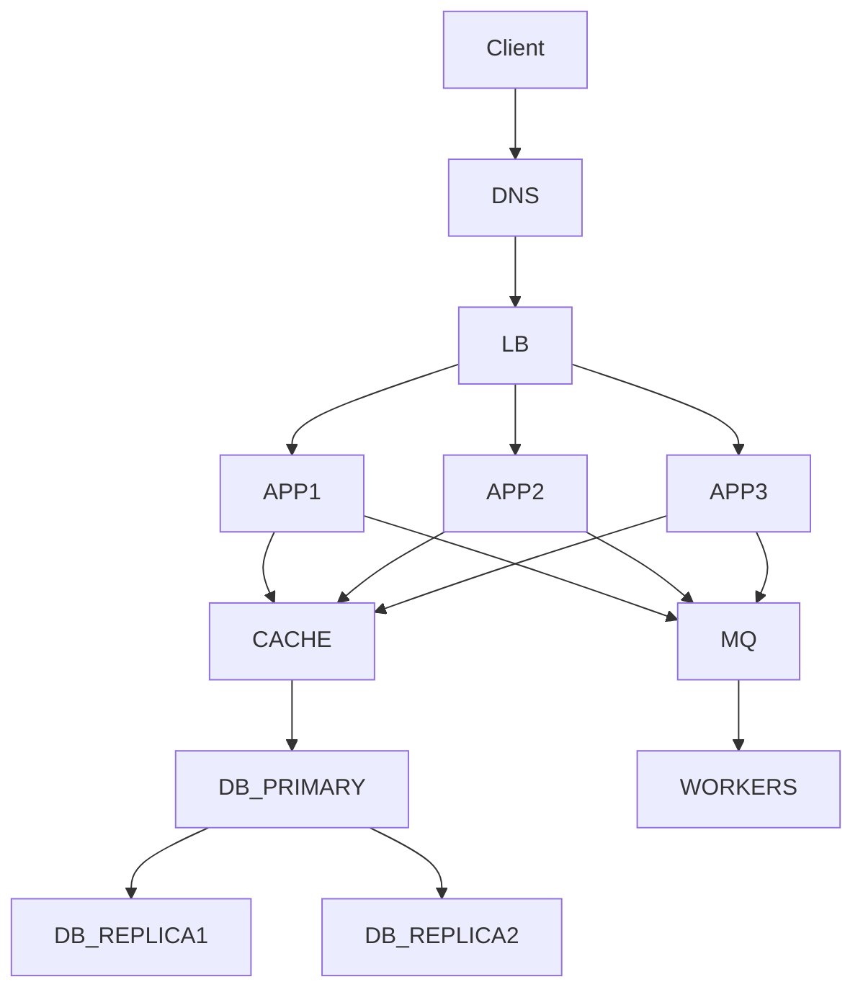
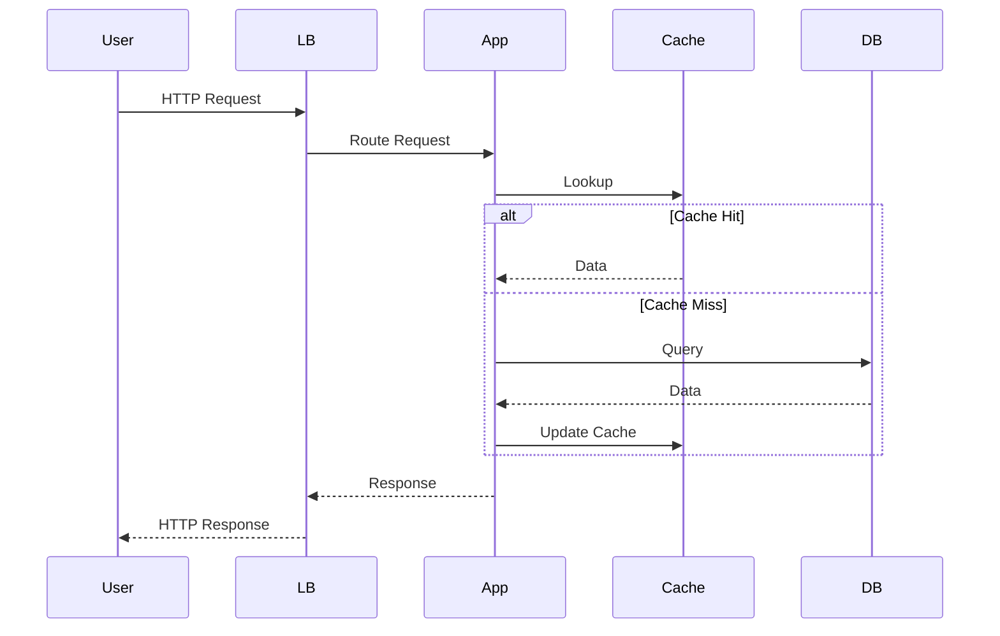
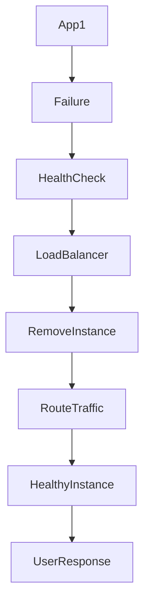

# 29. Real Enterprise Examples

> **The objective of studying enterprise architectures is not to copy them, but to understand the reasoning behind their design decisions.**

Every large technology company solves different business problems. Consequently, each optimizes High Availability differently.

---

# Amazon

## Business Problem

Amazon processes millions of customer requests every minute.

Customers expect:

* Shopping
* Checkout
* Payments
* Order Tracking
* Recommendations

to remain available continuously.

---

## Availability Challenges

* Flash sales
* Prime Day traffic
* Regional failures
* Continuous deployments
* Massive catalog size

---

## Architectural Approach

```text
Users
   │
   ▼
Global DNS
   │
   ▼
Regional Load Balancers
   │
   ▼
Multiple Availability Zones
   │
   ▼
Microservices
   │
   ▼
Distributed Databases
```

---

### Key Lessons

* Everything is redundant.
* Services fail independently.
* Automation replaces manual recovery.
* Every deployment assumes failures will occur.

---

# Netflix

## Business Problem

Customers expect uninterrupted video streaming worldwide.

Buffering or outages directly impact subscriber satisfaction.

---

## Availability Challenges

* Massive streaming traffic
* Global deployment
* Third-party cloud dependency
* Continuous feature releases

---

## Architectural Approach

Netflix focuses heavily on resilience.

Key practices include:

* Multi-region deployment
* Chaos Engineering
* Circuit Breakers
* Intelligent client retries
* Regional traffic isolation

---

### Key Lesson

Failures are intentionally introduced during normal operations to validate system resilience before real incidents occur.

---

# Google

## Business Problem

Google Search must remain available despite:

* Hardware failures
* Data center failures
* Software bugs
* Maintenance activities

---

## Architectural Characteristics

* Global distributed infrastructure
* Extensive data replication
* Automated failover
* Continuous monitoring
* Self-healing systems

---

### Key Lesson

Automation enables operation at global scale.

Human intervention cannot keep pace with the volume of infrastructure.

---

# Uber

## Business Problem

Drivers and riders must communicate in real time.

Availability directly affects:

* Trip matching
* Navigation
* Payments
* Pricing
* Safety

---

## Architectural Approach

* Microservices
* Event-driven communication
* Geographic isolation
* Independent scaling
* Real-time monitoring

---

### Key Lesson

Regional failures should affect only the impacted geography rather than the entire platform.

---

# Stripe

## Business Problem

Payment processing must remain available.

Even brief outages can prevent businesses worldwide from accepting payments.

---

## Architectural Priorities

* Fault isolation
* Idempotent APIs
* Database replication
* Strong observability
* Safe deployment practices

---

### Key Lesson

Correctness is as important as availability.

Processing duplicate payments is often worse than temporarily rejecting requests.

---

# Cloudflare

## Business Problem

Cloudflare sits between customers and millions of internet services.

Its availability directly influences the availability of downstream applications.

---

## Architectural Characteristics

* Global Anycast network
* Edge computing
* Distributed caching
* Automatic traffic routing
* DDoS mitigation

---

### Key Lesson

Traffic should automatically flow around localized failures.

---

# LinkedIn

## Business Problem

Support hundreds of millions of professionals worldwide.

---

## Availability Priorities

* Feed generation
* Messaging
* Search
* Notifications
* Profile services

---

### Key Lesson

Not every feature requires identical availability.

Core user functionality receives the highest protection.

---

# Spotify

## Business Problem

Provide uninterrupted music streaming.

---

## Availability Strategy

* Multi-region deployment
* CDN
* Distributed storage
* Independent microservices

---

### Key Lesson

Graceful degradation improves customer experience.

Temporary recommendation failures should not interrupt music playback.

---

# Meta

## Business Problem

Billions of users expect continuous access.

---

## Architectural Characteristics

* Massive distributed infrastructure
* Global replication
* Continuous deployment
* Large-scale observability

---

### Key Lesson

Automation becomes mandatory at extreme scale.

---

# Airbnb

## Business Problem

Travel bookings require multiple coordinated services.

---

## Availability Priorities

* Search
* Booking
* Payments
* Messaging
* Availability calendars

---

### Key Lesson

Critical booking workflows must remain operational even when secondary services experience failures.

---

# Enterprise Lessons Summary

| Company    | Primary Lesson                           |
| ---------- | ---------------------------------------- |
| Amazon     | Eliminate Single Points of Failure       |
| Netflix    | Test failures continuously               |
| Google     | Automate everything possible             |
| Uber       | Isolate failures geographically          |
| Stripe     | Prioritize correctness with availability |
| Cloudflare | Route traffic around failures            |
| LinkedIn   | Prioritize business-critical services    |
| Spotify    | Gracefully degrade non-critical features |
| Meta       | Invest heavily in observability          |
| Airbnb     | Protect core customer journeys           |

---

# 30. Architecture Diagrams

## High Availability Reference Architecture



---

## Request Flow



---

## Failure Flow



---

## Recovery Flow

```mermaid
flowchart TD

Failure

↓

Detection

↓

Automatic Failover

↓

Traffic Rerouting

↓

Replacement Instance

↓

Health Validation

↓

Normal Operations
```

---

# 31. Interview Preparation

## Beginner Questions

1. What is High Availability?
2. Why is High Availability important?
3. What is downtime?
4. What is a Single Point of Failure?
5. Explain Active-Active and Active-Passive.
6. What is failover?
7. What is redundancy?
8. Why are health checks required?
9. What is MTTR?
10. What is MTBF?

---

## Intermediate Questions

1. Design a highly available e-commerce application.
2. How would you remove Single Points of Failure?
3. Explain Multi-AZ deployment.
4. Why are retries dangerous?
5. Explain Circuit Breakers.
6. Explain graceful degradation.
7. What is the relationship between Availability and Scalability?
8. Why are load balancers important?
9. Explain database replication.
10. Compare synchronous and asynchronous replication.

---

## Advanced Questions

1. Design a globally available payment platform.
2. How would you achieve 99.999% availability?
3. Explain architecture during a regional outage.
4. Design zero-downtime deployment.
5. Explain error budgets.
6. Explain availability trade-offs.
7. Design cross-region failover.
8. Explain split brain.
9. Explain retry storms.
10. Design for graceful degradation.

---

## Leadership Questions

* How do you justify additional infrastructure cost to business stakeholders?
* How do you balance availability with engineering velocity?
* How would you prioritize resilience investments with a limited budget?
* When would you accept downtime rather than increasing architectural complexity?
* How would you lead an architecture review after a major production incident?

---

# 32. Common Interview Mistakes

| Incorrect Answer                       | Why It Is Wrong                                            | Better Answer                                                                     |
| -------------------------------------- | ---------------------------------------------------------- | --------------------------------------------------------------------------------- |
| "High Availability means no failures." | Failures are inevitable.                                   | High Availability minimizes customer impact despite failures.                     |
| "Add more servers."                    | Redundancy alone does not eliminate SPOFs.                 | Identify failure domains, remove SPOFs, automate failover, and validate recovery. |
| "Use Kubernetes."                      | Kubernetes is a technology, not an architectural strategy. | Explain the business objective first, then justify the technology choice.         |
| "Deploy across regions."               | Multi-region may be unnecessary and expensive.             | Align the architecture with business requirements and RTO/RPO targets.            |
| "Retries always improve reliability."  | Poorly configured retries can create retry storms.         | Use bounded retries with exponential backoff, jitter, and circuit breakers.       |

---

# 33. Best Practices

## Cloud

* Design for failure from the beginning.
* Deploy across multiple Availability Zones.
* Use managed services where appropriate.
* Automate failover and recovery.
* Validate Disaster Recovery plans regularly.

---

## Java / Spring Boot

* Configure connection, read, and write timeouts.
* Implement graceful shutdown.
* Expose readiness and liveness probes.
* Use Resilience4j for circuit breakers, retries, rate limiting, and bulkheads.
* Externalize configuration and secrets.
* Instrument applications with metrics and tracing.

---

## Kubernetes

* Use ReplicaSets and Deployments.
* Configure Pod Disruption Budgets.
* Implement Horizontal Pod Autoscalers.
* Use readiness, liveness, and startup probes correctly.
* Practice rolling and canary deployments.

---

## Architecture

* Remove Single Points of Failure.
* Minimize blast radius.
* Prefer graceful degradation over complete failure.
* Continuously test failover.
* Measure availability against SLOs.
* Review architecture after every significant incident.

---

# 34. Related Concepts

High Availability is closely connected to several other architectural quality attributes.

| Concept           | Relationship                                                                                                         |
| ----------------- | -------------------------------------------------------------------------------------------------------------------- |
| Reliability       | Reliability focuses on consistent operation over time; High Availability focuses on minimizing service interruption. |
| Fault Tolerance   | Fault Tolerance enables continued operation despite failures, supporting High Availability.                          |
| Scalability       | Scalability helps maintain availability under increased load.                                                        |
| Disaster Recovery | Disaster Recovery addresses catastrophic failures beyond the scope of normal High Availability mechanisms.           |
| Observability     | Monitoring, logging, and tracing enable rapid detection and recovery.                                                |
| Resilience        | Resilience encompasses the ability to withstand, adapt to, and recover from failures.                                |

These topics are covered in detail in subsequent chapters.

---

# 35. Further Reading

## Books

* *Designing Data-Intensive Applications* — Martin Kleppmann
* *Release It!* — Michael T. Nygard
* *Building Microservices* — Sam Newman
* *Site Reliability Engineering* — Google
* *Fundamentals of Software Architecture* — Mark Richards & Neal Ford

## Official References

* AWS Well-Architected Framework
* Google Site Reliability Engineering Guides
* Azure Architecture Center
* Kubernetes Documentation
* Martin Fowler Architecture Articles

---

# 36. Revision Notes

## One-Page Summary

* High Availability is a business capability, not merely a technical feature.
* Failures are inevitable; architects design systems to continue delivering value despite them.
* Remove Single Points of Failure through redundancy and failure isolation.
* Automate detection, failover, and recovery to reduce MTTR.
* Balance availability with cost and operational complexity.
* Measure success using SLIs, SLOs, SLAs, MTTR, MTBF, RTO, and RPO.
* Operational excellence—monitoring, logging, tracing, alerting, backups, and disaster recovery—is essential for sustaining availability.
* Review every production incident to improve architecture continuously.

---

# 37. Chapter Completion Checklist

```markdown
- [x] Business problem explained
- [x] Business impact discussed
- [x] High Availability defined
- [x] First principles introduced
- [x] Failure modes analyzed
- [x] Architecture decisions justified
- [x] Implementation mechanisms covered
- [x] Decision matrix completed
- [x] Trade-offs evaluated
- [x] Measurements defined
- [x] Operational considerations documented
- [x] Production incidents analyzed
- [x] Anti-patterns explained
- [x] Resource impact evaluated
- [x] Enterprise maturity model included
- [x] Architecture evolution presented
- [x] Review checklist completed
- [x] Production readiness checklist completed
- [x] ADR documented
- [x] Architecture heuristics summarized
- [x] Enterprise examples included
- [x] Architecture diagrams added
- [x] Interview preparation completed
- [x] Best practices documented
- [x] Further reading provided
- [x] Revision notes completed
```

---

# 38. Architect's Questions

Before approving any architecture for production, experienced architects naturally ask questions such as:

1. What business capability are we protecting?
2. What is the financial cost of one hour of downtime?
3. Where are the Single Points of Failure?
4. What happens if the primary database fails?
5. What happens if an entire Availability Zone becomes unavailable?
6. What happens if a cloud region fails?
7. Which dependencies are synchronous, and can they be made asynchronous?
8. How quickly can we detect failures?
9. How quickly can we recover without manual intervention?
10. What functionality can degrade gracefully?
11. How will we validate backups and disaster recovery?
12. How do we know when the system is unhealthy?
13. Are we meeting our SLOs consistently?
14. What is our current error budget?
15. What operational tasks remain manual?
16. Can this architecture evolve as the business grows?
17. Which trade-offs did we consciously accept?
18. Is the operational complexity justified by the business value?
19. Have we tested our assumptions under failure conditions?
20. If this system fails at the worst possible business moment, what happens next?

---

> **Chapter 1 Complete**

This concludes **Chapter 1 – High Availability**. It establishes the architectural mindset that will be used throughout the remainder of the handbook: **Business before Technology, Why before How, Trade-offs before Decisions, and Continuous Learning through Operations.**
