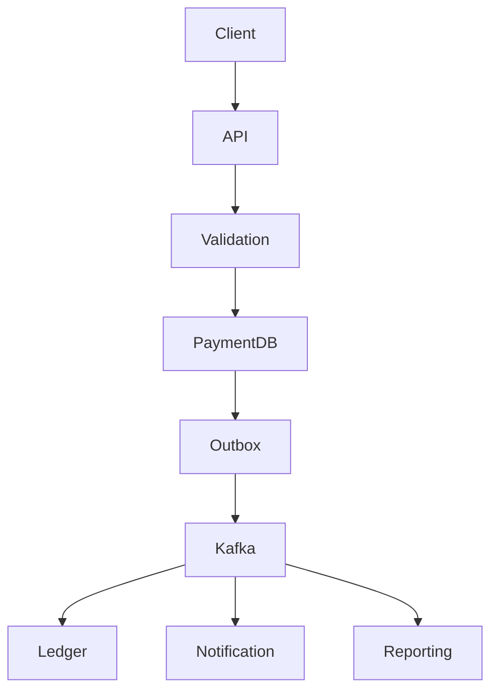
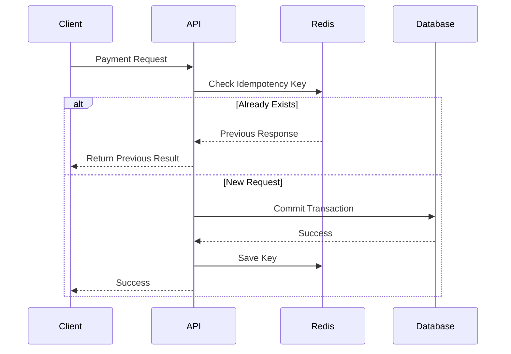
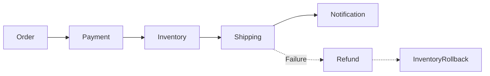

# 29. Real Enterprise Examples

> **Enterprise architectures are valuable not because they use fashionable technologies, but because they solve real business reliability problems at massive scale.**

The goal of studying these architectures is not to copy them.

It is to understand **why** certain architectural decisions were made.

---

# Stripe

## Business Problem

Stripe processes millions of financial transactions every day.

Every payment must satisfy one critical business rule:

> A customer should never be charged incorrectly.

---

## Reliability Challenges

- Network retries
- Duplicate API requests
- Banking delays
- Third-party failures
- High transaction volume

---

## Reliability Strategy

- Idempotency Keys
- Immutable transaction records
- Strong audit trails
- Financial reconciliation
- Safe retry mechanisms

---

### Key Lesson

Correctness is more important than speed.

A delayed payment is preferable to an incorrect payment.

---

# Amazon

## Business Problem

Millions of customer orders are processed every day.

Business rules include:

- Orders processed exactly once
- Inventory accuracy
- Correct pricing
- Accurate shipment tracking

---

## Reliability Strategy

- Event-driven architecture
- Distributed transactions using Saga
- Inventory reconciliation
- Continuous monitoring
- Automated recovery

---

### Key Lesson

Business correctness depends on reliable workflows rather than individual services.

---

# Netflix

## Business Problem

Streaming events generate enormous volumes of operational data.

Business rules include:

- Accurate subscriber billing
- Correct viewing history
- Personalized recommendations

---

## Reliability Strategy

- Event sourcing
- Reliable event streaming
- Replay capability
- Immutable logs
- Automated validation

---

### Key Lesson

Historical events provide a reliable source of truth.

---

# Google

## Business Problem

Search, storage, and productivity platforms require dependable data.

---

## Reliability Strategy

- Replicated storage
- Consensus protocols
- Data validation
- Continuous integrity verification
- Automated repair

---

### Key Lesson

Reliability depends on automation rather than manual intervention.

---

# Uber

## Business Problem

Trips involve multiple business operations:

- Rider matching
- Driver assignment
- Navigation
- Pricing
- Payment

---

## Reliability Strategy

- Event-driven communication
- Saga Pattern
- Idempotent APIs
- Audit events
- Compensation

---

### Key Lesson

Distributed workflows require reliable compensation rather than distributed locking.

---

# Airbnb

## Business Problem

Bookings involve:

- Availability
- Payment
- Calendar updates
- Notifications

---

## Reliability Strategy

- Reservation workflow
- Versioning
- Optimistic locking
- Reconciliation
- Event replay

---

### Key Lesson

Concurrency must be managed carefully during high-demand booking periods.

---

# Banking Systems

## Business Rule

```
Debit Once

+

Credit Once

=

Balanced Ledger
```

---

## Reliability Techniques

- ACID Transactions
- Double-entry bookkeeping
- Immutable ledger
- Daily reconciliation
- Regulatory auditing

---

### Key Lesson

Financial correctness always takes precedence over performance.

---

# Healthcare Systems

## Business Rule

Patient history must remain complete and accurate.

---

## Reliability Techniques

- Versioned medical records
- Immutable audit trails
- Strong validation
- Regulatory compliance
- Disaster recovery

---

### Key Lesson

Data integrity directly impacts patient safety.

---

# Enterprise Lessons Summary

| Organization | Primary Reliability Lesson |
|---------------|----------------------------|
| Stripe | Idempotency protects financial correctness |
| Amazon | Reliable business workflows matter more than reliable individual services |
| Netflix | Immutable events simplify recovery |
| Google | Automation improves long-term reliability |
| Uber | Distributed workflows require compensation |
| Airbnb | Concurrency management prevents booking conflicts |
| Banking | Financial integrity is non-negotiable |
| Healthcare | Data correctness protects lives |

---

# 30. Architecture Diagrams

## Reliable Payment Processing



---

## Idempotent Request Flow



---

## Outbox Pattern

```mermaid
flowchart TD

Application

↓

Database Transaction

↓

Save Order

+

Save Outbox Event

↓

Commit

↓

Background Publisher

↓

Kafka

↓

Consumers
```

---

## Saga Workflow



---

## Event Sourcing

```text
Account Opened

↓

Deposit ₹1000

↓

Deposit ₹500

↓

Withdraw ₹200

↓

Current Balance

₹1300
```

Current state is derived from immutable history.

---

# 31. Interview Preparation

## Beginner Questions

1. What is Reliability?
2. How is Reliability different from Availability?
3. What is idempotency?
4. What is data integrity?
5. Why are transactions important?
6. What causes duplicate processing?
7. What is optimistic locking?
8. What is reconciliation?
9. What is an audit trail?
10. Why is validation important?

---

## Intermediate Questions

1. Design a reliable payment service.
2. Explain duplicate payment prevention.
3. Compare ACID and BASE.
4. Explain Event Sourcing.
5. Explain the Outbox Pattern.
6. Explain Saga Pattern.
7. How would you detect silent data corruption?
8. Design a reliable inventory system.
9. Explain optimistic locking with an example.
10. How would you implement reliable messaging?

---

## Advanced Questions

1. Design a globally reliable payment platform.
2. Explain exactly-once processing.
3. Compare Event Sourcing with traditional CRUD.
4. Design reliable financial reconciliation.
5. Explain consistency trade-offs.
6. Explain distributed transaction alternatives.
7. Design a fault-tolerant event processing system.
8. Explain reliability metrics.
9. Design a multi-region banking platform.
10. Explain reliability in event-driven architectures.

---

## Leadership Questions

- How do you justify additional reliability investment to business stakeholders?
- Which business operations deserve the highest reliability guarantees?
- How would you prioritize reliability improvements with limited engineering capacity?
- How should teams measure business correctness?
- What operational practices would you establish to sustain reliability?

---

# 32. Common Interview Mistakes

| Incorrect Answer | Why It Is Wrong | Better Answer |
|------------------|-----------------|---------------|
| "Reliable means always online." | Availability and Reliability are different. | Reliability means producing correct business outcomes consistently. |
| "Retries solve failures." | Retries can create duplicates. | Retries require idempotency and controlled retry policies. |
| "Transactions solve every consistency problem." | Distributed systems extend beyond a single database transaction. | Use ACID where appropriate and patterns such as Saga for distributed workflows. |
| "Kafka guarantees exactly-once everywhere." | End-to-end exactly-once semantics require careful application design. | Combine reliable messaging with idempotent processing. |
| "Audit logs are only for compliance." | Audit logs also support debugging, reconciliation, and incident investigation. | Treat audit history as a core reliability mechanism. |

---

# 33. Best Practices

## Architecture

- Protect business rules before optimizing performance.
- Treat business data as the source of truth.
- Design every critical operation to be idempotent.
- Record immutable business history.
- Prefer explicit validation over assumptions.

---

## Data

- Use transactions where strong consistency is required.
- Validate data before persistence.
- Detect and resolve version conflicts.
- Regularly verify data integrity.

---

## Messaging

- Use durable messaging.
- Implement the Outbox Pattern.
- Make consumers idempotent.
- Configure Dead Letter Queues.
- Monitor message delivery continuously.

---

## Operations

- Continuously reconcile business data.
- Verify backups through restore testing.
- Monitor business metrics in addition to infrastructure metrics.
- Perform regular failure simulations.
- Review every reliability incident and improve the architecture.

---

# 34. Related Concepts

Reliability is closely connected to several other architectural qualities.

| Concept | Relationship |
|----------|--------------|
| High Availability | Ensures systems remain accessible; Reliability ensures they produce correct results. |
| Fault Tolerance | Helps systems continue operating during failures, supporting Reliability. |
| Resilience | Enables systems to recover while maintaining business correctness. |
| Durability | Ensures committed data is not lost. |
| Consistency | Preserves valid business state across operations. |
| Observability | Enables detection and investigation of reliability failures. |
| Scalability | Supports increased workload without compromising correctness. |
| Security | Protects the integrity and authenticity of business data. |

---

# 35. Further Reading

## Books

- *Designing Data-Intensive Applications* — Martin Kleppmann
- *Release It!* — Michael T. Nygard
- *Building Microservices* — Sam Newman
- *Site Reliability Engineering* — Google
- *Fundamentals of Software Architecture* — Mark Richards & Neal Ford

---

## Research Topics

- Consensus Algorithms
- Distributed Transactions
- Event Sourcing
- CRDTs
- Exactly-Once Processing
- Distributed Databases
- Formal Verification

---

## Official Documentation

- Apache Kafka
- RabbitMQ
- PostgreSQL
- Redis
- Spring Framework
- Kubernetes
- AWS Well-Architected Framework

---

# 36. Revision Notes

## One-Page Summary

- Reliability means consistently producing correct business outcomes.
- High Availability and Reliability are complementary but different quality attributes.
- Business correctness is more important than infrastructure uptime.
- Common reliability risks include duplicate processing, lost updates, race conditions, and silent data corruption.
- Idempotency, transactions, validation, immutable audit logs, Outbox Pattern, Saga, reconciliation, and observability are key architectural mechanisms.
- Reliability requires continuous measurement through business metrics, reconciliation, and operational verification.
- Every architectural decision should prioritize customer trust and business integrity.

---

# 37. Chapter Completion Checklist

```markdown
- [x] Business problem explained
- [x] Reliability defined
- [x] Business goals established
- [x] Quality attribute relationships compared
- [x] Failure modes analyzed
- [x] Architecture decisions explained
- [x] Reliability mechanisms covered
- [x] Decision matrix completed
- [x] Trade-offs evaluated
- [x] Measurements defined
- [x] Operational considerations documented
- [x] Production incidents analyzed
- [x] Anti-patterns explained
- [x] Resource impact evaluated
- [x] Enterprise maturity model included
- [x] Architecture evolution presented
- [x] Architecture review checklist completed
- [x] Production readiness checklist completed
- [x] ADR documented
- [x] Architecture thinking tips summarized
- [x] Enterprise examples included
- [x] Architecture diagrams added
- [x] Interview preparation completed
- [x] Best practices documented
- [x] Related concepts summarized
- [x] Further reading provided
- [x] Revision notes completed
```

---

# 38. Architect's Questions

Before approving a production architecture, experienced architects ask questions such as:

1. Which business rules must never be violated?
2. What happens if this request is processed twice?
3. What happens if a message is lost?
4. Can two users modify the same business entity simultaneously?
5. Can we reconstruct every business event from history?
6. How do we detect silent data corruption?
7. Is reconciliation automated?
8. Can every important transaction be audited?
9. Are retries guaranteed to be safe?
10. Can the system recover from partial failures?
11. What assumptions are we making about external systems?
12. How do we verify data integrity over time?
13. Which failures are acceptable, and which are not?
14. What metrics demonstrate business correctness?
15. How will this architecture evolve as transaction volume grows?
16. Is the additional reliability complexity justified by business value?
17. Have we tested failure scenarios under production-like conditions?
18. Can customers trust every critical business outcome produced by this system?

---

# Chapter Summary

Reliability is the architectural discipline of ensuring that software consistently produces **correct, trustworthy, and predictable business outcomes**.

Unlike Availability, which answers **"Can customers access the system?"**, Reliability answers **"Can customers trust the results?"**

Modern architects achieve Reliability by combining:

- Strong business rule enforcement
- Thoughtful architectural decisions
- Reliable implementation mechanisms
- Continuous operational verification
- Blameless learning from production incidents

Reliability is not a feature that can be added later.

It is a design philosophy that influences every architectural decision, from data modeling and messaging to monitoring, recovery, and governance.

---

> **Chapter 2 Complete**

This concludes **Chapter 2 – Reliability**.

Together, **Chapter 1 – High Availability** and **Chapter 2 – Reliability** establish the two foundational pillars of enterprise system design:

- **High Availability** ensures systems remain accessible.
- **Reliability** ensures systems remain correct.

Every subsequent quality attribute—Scalability, Fault Tolerance, Resilience, Consistency, Performance, Security, and Observability—builds upon these two foundations.
