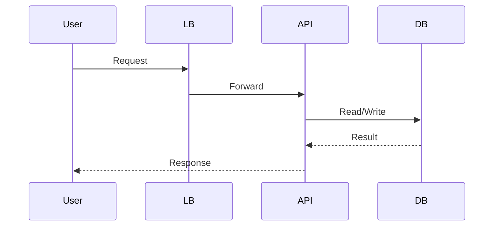
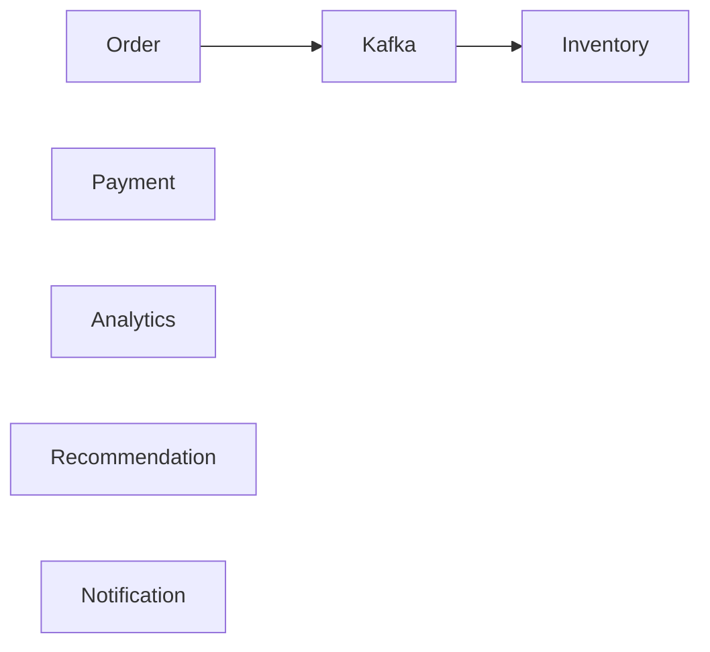

# 28. Real Enterprise Examples

> **Large-scale systems do not become scalable because they use modern technologies. They become scalable because every architectural decision aligns with a specific business growth challenge.**

Studying enterprise architectures helps architects understand *why* particular scalability patterns exist.

The objective is not to copy these architectures.

The objective is to understand the engineering principles behind them.

---

# Amazon

## Business Problem

Amazon processes:

- Millions of customers
- Millions of products
- Millions of orders
- Millions of payments

every single day.

Traffic varies dramatically during:

- Prime Day
- Black Friday
- Holiday Sales

---

## Scalability Challenges

- Product Search
- Inventory Updates
- Recommendation Engine
- Checkout
- Order Processing
- Shipment Tracking

Each subsystem scales differently.

---

## Architecture Strategy

Amazon uses:

- Stateless services
- Horizontal scaling
- Distributed caching
- Event-driven communication
- Database partitioning
- Asynchronous workflows

---

## Business Lesson

Different business capabilities scale independently.

Search should not depend on checkout.

Checkout should not depend on recommendations.

Loose coupling enables independent scalability.

---

# Netflix

## Business Problem

Netflix serves:

- Millions of concurrent viewers
- Thousands of movies
- Continuous video streaming

across the globe.

---

## Scalability Challenges

- Video Streaming
- Recommendations
- Search
- User Profiles
- Viewing History

---

## Architecture Strategy

Netflix relies heavily on:

- CDN
- Edge Caching
- Microservices
- Event Streaming
- Autoscaling
- Chaos Engineering

---

## Business Lesson

Content should move closer to customers rather than customers always reaching the origin server.

---

# Google Search

## Business Problem

Billions of searches occur daily.

Each search must complete within milliseconds.

---

## Scalability Challenges

- Massive indexing
- Ranking
- Storage
- Global traffic
- Continuous crawling

---

## Architecture Strategy

- Distributed indexing
- Massive parallel processing
- Geographic distribution
- Replicated infrastructure
- Intelligent caching

---

## Business Lesson

Large-scale search depends on distributing both storage and computation.

---

# Uber

## Business Problem

Each ride involves:

- Driver availability
- Rider location
- Pricing
- Matching
- Payments
- Notifications

---

## Scalability Challenges

Traffic changes constantly.

Rush hour traffic differs dramatically from midnight traffic.

---

## Architecture Strategy

Uber employs:

- Event-driven architecture
- Geographic partitioning
- Distributed messaging
- Independent microservices
- Real-time processing

---

## Business Lesson

Different cities behave like independent scalability domains.

---

# Airbnb

## Business Problem

Bookings require:

- Property availability
- Calendar synchronization
- Payments
- Notifications
- Reviews

---

## Scalability Challenges

High-demand events:

- Olympics
- Festivals
- Holidays

produce localized traffic spikes.

---

## Architecture Strategy

- Caching
- Optimistic locking
- Search indexing
- Read replicas
- Geographic optimization

---

## Business Lesson

Read-heavy workloads benefit enormously from caching and search indexes.

---

# Spotify

## Business Problem

Millions of users simultaneously:

- Search music
- Stream audio
- Generate playlists
- Receive recommendations

---

## Scalability Strategy

- CDN
- Event streaming
- Distributed storage
- Recommendation pipelines
- Independent services

---

## Business Lesson

Streaming workloads prioritize bandwidth scalability over transactional scalability.

---

# Stripe

## Business Problem

Payment APIs receive unpredictable global traffic.

---

## Scalability Strategy

- Stateless APIs
- Horizontal scaling
- Idempotent processing
- Distributed queues
- Database optimization

---

## Business Lesson

Scalability should never compromise financial correctness.

---

# Enterprise Lessons Summary

| Organization | Primary Scalability Lesson |
|---------------|---------------------------|
| Amazon | Scale business domains independently |
| Netflix | Move content closer to customers |
| Google | Distribute computation and storage |
| Uber | Partition geographically |
| Airbnb | Optimize read-heavy workloads |
| Spotify | Scale media delivery separately from metadata |
| Stripe | Scale without sacrificing correctness |

---

# 29. Architecture Diagrams

## Horizontally Scalable Web Application

```mermaid
flowchart TD

Users

↓

CDN

↓

LoadBalancer

↓

API1

API2

API3

↓

Redis

↓

Database
```

---

# Stateless API Architecture



No server maintains user session state.

---

# Horizontal Scaling

```text
Small Scale

User

↓

Server
```

↓

```text
Growing Scale

Users

↓

Load Balancer

↓

Server A

Server B

Server C
```

↓

```text
Enterprise Scale

Users

↓

Global Load Balancer

↓

Region A

Region B

Region C
```

---

# Read Scaling

```mermaid
flowchart TD

Application

↓

Primary Database

↓

Replica A

Replica B

Replica C
```

Writes remain centralized.

Reads scale horizontally.

---

# Cache Architecture

```mermaid
flowchart TD

Application

↓

Redis

↓

Database
```

Frequently accessed data bypasses the database.

---

# Database Sharding

```text
Customers

↓

Shard A

Customer 1-1M

↓

Shard B

Customer 1M-2M

↓

Shard C

Customer 2M-3M
```

---

# Event-Driven Scalability



Each consumer scales independently.

---

# Autoscaling

```text
Traffic

↓

Monitoring

↓

Scaling Policy

↓

New Instances

↓

Higher Capacity
```

---

# 30. Interview Preparation

## Beginner Questions

1. What is Scalability?
2. Why is Scalability important?
3. Explain Vertical Scaling.
4. Explain Horizontal Scaling.
5. What is a bottleneck?
6. What is throughput?
7. What is latency?
8. What is load balancing?
9. What is autoscaling?
10. What is caching?

---

## Intermediate Questions

1. Design a scalable URL shortener.
2. Design a scalable chat application.
3. Explain database sharding.
4. Explain read replicas.
5. Compare partitioning and sharding.
6. Explain CDN.
7. Explain queue-based scaling.
8. Explain CQRS.
9. Explain Event-Driven Architecture.
10. Design scalable notification delivery.

---

## Advanced Questions

1. Design Amazon's product search.
2. Design YouTube upload architecture.
3. Design Netflix streaming.
4. Design WhatsApp messaging.
5. Design Uber ride matching.
6. Design global payment processing.
7. Design a system handling one million RPS.
8. Explain hot partitions.
9. Explain scaling databases.
10. Design multi-region architecture.

---

## Leadership Questions

- How would you justify scalability investment to business stakeholders?
- When should an organization move from a monolith to distributed services?
- How do you balance scalability with operational simplicity?
- What metrics indicate that the current architecture will soon become a bottleneck?
- How would you prioritize scalability improvements with a fixed engineering budget?

---

# 31. Common Interview Mistakes

| Incorrect Statement | Why It Is Incorrect | Better Answer |
|---------------------|--------------------|---------------|
| "Adding servers always solves scalability." | Bottlenecks may exist in the database, network, or application design. | Identify the bottleneck before scaling. |
| "Horizontal scaling is always better." | Some workloads benefit more from vertical scaling. | Choose the scaling strategy based on workload characteristics. |
| "Caching fixes all performance problems." | Caching helps read-heavy workloads but not write bottlenecks or poor algorithms. | Use caching selectively with a clear invalidation strategy. |
| "Microservices automatically scale better." | Poorly designed microservices can introduce network latency and operational complexity. | Decompose services based on business domains and scaling needs. |
| "Kubernetes makes an application scalable." | Kubernetes scales infrastructure, not inefficient code or bad database design. | Build a scalable architecture first, then automate infrastructure scaling. |

---

# 32. Best Practices

## Architecture

- Design stateless services whenever possible.
- Identify bottlenecks before adding infrastructure.
- Separate read-heavy and write-heavy workloads.
- Scale business capabilities independently.
- Prefer asynchronous processing for long-running tasks.

---

## Databases

- Optimize queries before upgrading hardware.
- Use indexing effectively.
- Introduce read replicas for read-heavy systems.
- Partition data before sharding.
- Monitor connection pool utilization.

---

## Caching

- Cache frequently accessed, stable data.
- Monitor cache hit ratio continuously.
- Design cache invalidation carefully.
- Protect against cache stampedes.

---

## Infrastructure

- Automate scaling.
- Maintain sufficient capacity headroom.
- Test autoscaling policies regularly.
- Use Infrastructure as Code.

---

## Operations

- Perform regular load tests.
- Monitor business metrics alongside infrastructure metrics.
- Continuously review capacity forecasts.
- Conduct post-incident reviews after scalability events.

---

# 33. Related Concepts

Scalability interacts closely with other quality attributes.

| Concept | Relationship |
|----------|--------------|
| High Availability | Additional instances improve availability and support horizontal scaling. |
| Reliability | Scaling should preserve business correctness under higher workloads. |
| Performance | Performance measures current speed; scalability measures sustained growth. |
| Elasticity | Elasticity automatically adjusts resources to support scalability. |
| Capacity Planning | Forecasts future demand and guides scaling decisions. |
| Fault Tolerance | Prevents localized failures from limiting scalability. |
| Observability | Detects bottlenecks before they affect customers. |
| Cost Optimization | Ensures growth remains economically sustainable. |

---

# 34. Further Reading

## Books

- *Designing Data-Intensive Applications* — Martin Kleppmann
- *Building Microservices* — Sam Newman
- *Release It!* — Michael T. Nygard
- *Site Reliability Engineering* — Google
- *The Art of Scalability* — Martin Abbott & Michael Fisher

---

## Research Topics

- Distributed Systems
- Queueing Theory
- Little's Law
- CAP Theorem
- Consistent Hashing
- CRDTs
- Distributed Databases
- Adaptive Load Balancing

---

## Official Documentation

- Kubernetes Documentation
- Apache Kafka Documentation
- Redis Documentation
- NGINX Documentation
- AWS Well-Architected Framework
- Azure Architecture Center
- Google Cloud Architecture Framework

---

# 35. Revision Notes

## One-Page Summary

- Scalability is the ability to support increasing workload while maintaining acceptable performance.
- Growth occurs across users, traffic, data, geography, features, and engineering teams.
- Every scalable system eventually encounters bottlenecks that must be identified and removed.
- Core scalability techniques include stateless services, horizontal scaling, caching, load balancing, partitioning, sharding, CQRS, event-driven architecture, and asynchronous processing.
- Capacity planning and continuous measurement are essential to long-term scalability.
- Scalability requires balancing growth with cost, complexity, and operational maturity.
- The simplest architecture that satisfies projected business growth is often the best solution.

---

# 36. Chapter Completion Checklist

```markdown
- [x] Business problem explained
- [x] Scalability defined
- [x] Business goals established
- [x] Quality attribute relationships compared
- [x] Growth dimensions explained
- [x] Workload types analyzed
- [x] Bottlenecks identified
- [x] Architecture decisions documented
- [x] Scalability mechanisms covered
- [x] Decision matrix completed
- [x] Trade-offs evaluated
- [x] Measurements defined
- [x] Capacity planning explained
- [x] Operational considerations documented
- [x] Production incidents analyzed
- [x] Anti-patterns explained
- [x] Resource impact evaluated
- [x] Enterprise maturity model included
- [x] Architecture evolution presented
- [x] Architecture review checklist completed
- [x] Production readiness checklist completed
- [x] Architecture Decision Record documented
- [x] Architecture thinking tips summarized
- [x] Enterprise examples included
- [x] Architecture diagrams added
- [x] Interview preparation completed
- [x] Best practices documented
- [x] Related concepts summarized
- [x] Further reading provided
- [x] Revision notes completed
```

---

# 37. Architect's Questions

Before approving a production architecture, experienced architects ask:

1. What type of growth are we expecting?
2. Which component becomes the bottleneck first?
3. Can capacity increase without application redesign?
4. Are services stateless?
5. Can the database scale independently?
6. Have we planned for seasonal traffic spikes?
7. Is caching reducing unnecessary database traffic?
8. Can autoscaling respond quickly enough to demand?
9. How much capacity headroom exists today?
10. What is the infrastructure cost per transaction?
11. Can this architecture support 10× growth?
12. Which architectural decision becomes invalid at 100× scale?
13. Are scalability assumptions validated through load testing?
14. How will the architecture evolve over the next five years?
15. Is the additional scalability complexity justified by projected business growth?

---

# Chapter Summary

Scalability is the architectural discipline of enabling software systems to **grow predictably, efficiently, and economically** as business demand increases.

Unlike **Performance**, which focuses on current responsiveness, scalability focuses on sustaining acceptable performance as users, traffic, data, and business operations expand.

Successful scalability is achieved through:

- Business-driven capacity planning
- Stateless architecture
- Horizontal scaling
- Intelligent workload distribution
- Caching and asynchronous processing
- Continuous measurement
- Operational excellence
- Incremental architectural evolution

Scalability is not about building for infinite growth on day one.

It is about ensuring that **each stage of business growth can be supported without requiring a complete architectural redesign**.

---

# Connection to Previous Chapters

Together, the first three chapters establish the core foundation of enterprise architecture:

| Chapter | Primary Question |
|---------|------------------|
| **Chapter 1 – High Availability** | Can customers access the system? |
| **Chapter 2 – Reliability** | Can customers trust the results? |
| **Chapter 3 – Scalability** | Can the system continue growing with business demand? |

These quality attributes reinforce one another:

- **High Availability** keeps services accessible.
- **Reliability** ensures business correctness.
- **Scalability** enables sustainable growth.

Every subsequent quality attribute—such as **Performance**, **Fault Tolerance**, **Resilience**, **Consistency**, **Security**, and **Observability**—builds on these three foundational pillars.

---

> **Chapter 3 Complete**

This concludes **Chapter 3 – Scalability**.

The next chapter in the handbook should naturally progress to **Chapter 4 – Performance**, where the focus shifts from *handling more work* to *handling each unit of work faster and more efficiently*.
