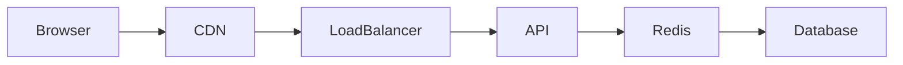
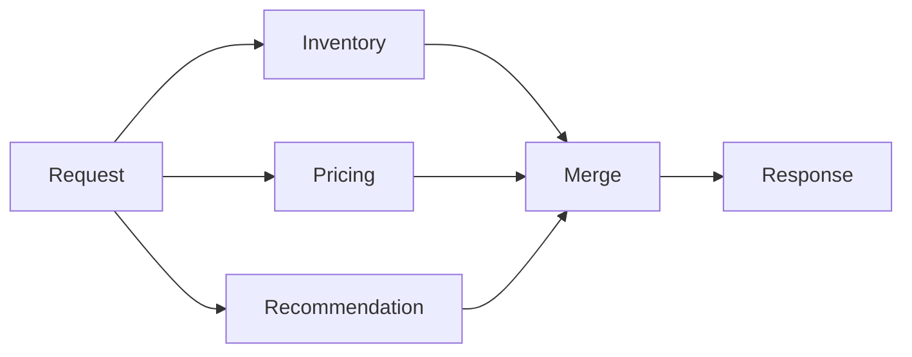

# 31. Real Enterprise Examples

> **Enterprise systems achieve exceptional performance not by optimizing every component, but by optimizing the components that matter most to their business.**

Every successful technology company has different performance goals.

A stock trading platform optimizes microseconds.

Netflix optimizes video startup latency.

Amazon optimizes checkout.

Google optimizes search latency.

Spotify optimizes streaming.

The architecture always follows the business.

---

# Amazon

## Business Problem

Amazon receives millions of requests every minute.

Critical workflows include:

- Product Search
- Recommendations
- Shopping Cart
- Checkout
- Payments
- Order Tracking

Each workflow has different performance requirements.

---

## Performance Strategy

Amazon focuses on:

- Aggressive caching
- Read replicas
- DynamoDB
- Asynchronous workflows
- CDN
- Service isolation

---

## Performance Optimization

Example:

Product Detail Page

```
Customer

↓

CloudFront

↓

Application

↓

Redis

↓

Database
```

Database traffic is minimized.

---

## Lesson

Do not compute identical results repeatedly.

Cache aggressively.

---

# Google Search

## Business Problem

Billions of searches occur every day.

Users expect:

```
Less than

500 ms
```

for search results.

---

## Performance Challenges

- Massive indexing
- Ranking algorithms
- Geographic distribution
- Query optimization

---

## Performance Strategy

Google emphasizes:

- Distributed indexes
- Parallel query execution
- In-memory caching
- Global edge infrastructure

---

## Lesson

Distribute computation instead of increasing single-machine power.

---

# Netflix

## Business Problem

Millions of users stream video simultaneously.

Performance metrics include:

- Video startup time
- Buffering frequency
- Recommendation latency

---

## Architecture

Netflix employs:

- CDN
- Edge caching
- Adaptive bitrate streaming
- Microservices
- Regional deployments

---

## Performance Optimization

Videos are delivered from edge servers nearest to customers.

```
User

↓

Edge Server

↓

Video
```

instead of:

```
User

↓

US Data Center
```

---

## Lesson

Move content closer to customers.

---

# Uber

## Business Problem

Ride requests require:

- Driver lookup
- Pricing
- ETA
- Route generation
- Notifications

within seconds.

---

## Optimization

Uber uses:

- Geographic partitioning
- Distributed caches
- Event-driven communication
- Regional services

---

## Lesson

Performance depends heavily on locality.

---

# Stripe

## Business Problem

Payments must complete quickly.

However,

Correctness is more important than absolute speed.

---

## Strategy

- Idempotent APIs
- Database optimization
- Queue processing
- Connection pooling

---

## Lesson

Optimize while preserving financial integrity.

---

# LinkedIn

## Business Problem

Millions of users request:

- News Feed
- Messaging
- Search
- Notifications

simultaneously.

---

## Performance Techniques

- Distributed caching
- Feed precomputation
- Search indexing
- Read replicas

---

## Lesson

Precompute expensive operations whenever possible.

---

# Spotify

## Business Problem

Music playback should begin almost immediately.

---

## Strategy

- CDN
- Local caching
- Streaming optimization
- Recommendation pipelines

---

## Lesson

Different workloads require different optimization strategies.

Streaming optimization differs from transactional optimization.

---

# Enterprise Lessons Summary

| Company | Primary Performance Lesson |
|----------|----------------------------|
| Amazon | Cache aggressively |
| Google | Parallel computation |
| Netflix | Edge delivery |
| Uber | Geographic optimization |
| Stripe | Correctness before speed |
| LinkedIn | Precompute expensive work |
| Spotify | Optimize based on workload type |

---

# 32. Performance Architecture Diagrams

## End-to-End Request Flow



---

## Cache Architecture

```mermaid
flowchart TD

Client

↓

API

↓

Redis

↓

Database
```

---

## Parallel Processing



---

## Asynchronous Processing

```mermaid
flowchart TD

User

↓

API

↓

Queue

↓

Worker

↓

Database
```

---

## Read Replica

```mermaid
flowchart TD

Application

↓

Primary DB

↓

Replica 1

Replica 2

Replica 3
```

---

## CDN Architecture

```text
Global Users

↓

Nearest Edge

↓

Origin Server
```

---

# 33. Performance War Stories

## Story 1 — CPU Was Never the Problem

A payment platform experienced:

```
5 Second Responses
```

Engineering immediately upgraded servers.

Performance barely changed.

Root Cause:

```
Database Locking
```

CPU utilization:

```
22%
```

Lesson:

Always identify the bottleneck before scaling.

---

## Story 2 — Cache Saved Millions

An e-commerce platform launched a holiday sale.

Traffic increased:

```
40×

Normal
```

Without Redis,

the database failed.

With Redis:

```
95%

Cache Hit
```

Database utilization remained stable.

Lesson:

Caching frequently provides the highest ROI optimization.

---

## Story 3 — Faster Algorithm

A reporting system required:

```
18 Minutes
```

Investigation revealed:

```
O(n²)
```

algorithm.

Replacing it with:

```
O(n log n)
```

reduced execution time to:

```
40 Seconds
```

without changing infrastructure.

Lesson:

Algorithms outperform hardware upgrades.

---

## Story 4 — Network Latency

A microservice architecture contained:

```
27 REST Calls
```

for one request.

Each call:

```
25 ms
```

Total:

```
675 ms
```

before business logic.

Aggregating services reduced latency dramatically.

Lesson:

Network latency accumulates quickly.

---

# 34. Interview Preparation

## Beginner Questions

1. What is performance?
2. Define latency.
3. Define throughput.
4. Difference between latency and response time?
5. What is a bottleneck?
6. What is caching?
7. What is connection pooling?
8. What is compression?
9. What is batching?
10. What is profiling?

---

## Intermediate Questions

1. Design a low-latency search service.
2. Explain cache invalidation.
3. Explain N+1 query problem.
4. Explain connection pools.
5. Explain thread pools.
6. Explain JVM GC.
7. Explain Virtual Threads.
8. Explain Performance Budget.
9. Explain Little's Law.
10. Explain Amdahl's Law.

---

## Senior Architect Questions

1. How would you reduce API latency from 800 ms to 150 ms?
2. How do you identify bottlenecks in distributed systems?
3. Design a payment platform with strict latency targets.
4. Design a high-performance AI inference platform.
5. Explain tail latency.
6. Explain Performance Budget ownership.
7. Explain production performance monitoring.
8. Explain performance testing strategy.
9. Explain JVM tuning for enterprise systems.
10. Explain trade-offs between cache consistency and latency.

---

# 35. Common Interview Mistakes

| Incorrect Statement | Better Answer |
|--------------------|---------------|
| More CPU solves performance | Identify the bottleneck first |
| Caching fixes everything | Cache appropriate workloads only |
| Average latency is enough | Monitor P95 and P99 |
| Horizontal scaling improves performance | It improves capacity; performance depends on architecture |
| Faster hardware is always cheaper | Optimize software before infrastructure |

---

# 36. Best Practices

## Architecture

- Optimize the largest bottleneck first.
- Design stateless services.
- Reduce unnecessary network calls.
- Cache frequently accessed data.
- Parallelize independent operations.

---

## Databases

- Review execution plans.
- Index carefully.
- Avoid `SELECT *`.
- Use pagination.
- Monitor slow queries continuously.

---

## JVM

- Select the appropriate garbage collector.
- Monitor heap usage.
- Use Virtual Threads for IO-heavy workloads.
- Size thread pools appropriately.

---

## Infrastructure

- Enable compression.
- Use CDN.
- Test Auto Scaling.
- Benchmark regularly.
- Monitor tail latency.

---

## Operations

- Continuously profile production.
- Perform regular load testing.
- Review performance budgets quarterly.
- Conduct post-incident reviews.

---

# 37. Related Concepts

Performance closely interacts with other architectural quality attributes.

| Concept | Relationship |
|----------|--------------|
| High Availability | Fast systems must also remain available. |
| Reliability | Fast responses must remain correct. |
| Scalability | Performance focuses on efficiency; scalability focuses on growth. |
| Fault Tolerance | Performance should degrade gracefully during failures. |
| Resilience | Recovery should maintain acceptable response times. |
| Observability | Metrics and tracing expose bottlenecks. |
| Capacity Planning | Predicts future performance requirements. |
| Cost Optimization | Performance improvements should justify their operational cost. |

---

# 38. Further Reading

## Books

- **Designing Data-Intensive Applications** — Martin Kleppmann
- **Systems Performance** — Brendan Gregg
- **Release It!** — Michael T. Nygard
- **Site Reliability Engineering** — Google
- **Java Performance** — Scott Oaks

---

## Research Topics

- Queueing Theory
- Amdahl's Law
- Little's Law
- CPU Cache Optimization
- NUMA Architectures
- Lock-Free Algorithms
- Distributed Tracing
- Adaptive Load Balancing

---

## Official Documentation

- OpenJDK Performance Documentation
- Spring Boot Performance Guide
- Redis Documentation
- Apache Kafka Performance Tuning
- Kubernetes Performance Best Practices
- AWS Well-Architected Framework – Performance Efficiency Pillar
- Azure Architecture Center – Performance
- Google Cloud Architecture Framework – Performance

---

# 39. Revision Notes

## One-Page Summary

- Performance measures how efficiently a system processes workloads.
- Latency, throughput, utilization, and tail latency are fundamental metrics.
- Performance engineering begins with measurement—not optimization.
- Response time is influenced by every component in the request path.
- Caching, batching, asynchronous processing, and efficient algorithms often provide the greatest improvements.
- Profiling, benchmarking, and continuous monitoring validate optimization efforts.
- Every performance improvement introduces trade-offs involving cost, complexity, or consistency.
- Business goals—not benchmark scores—should determine optimization priorities.

---

# 40. Chapter Completion Checklist

```markdown
- [x] Business problem explained
- [x] Performance defined
- [x] Business goals established
- [x] Performance fundamentals covered
- [x] Response time, latency, throughput explained
- [x] Performance budget introduced
- [x] Bottleneck analysis covered
- [x] CPU-bound vs IO-bound workloads explained
- [x] Architecture decisions documented
- [x] Performance mechanisms explained
- [x] JVM and Spring Boot tuning included
- [x] Cloud optimization discussed
- [x] Trade-offs evaluated
- [x] Measurements and KPIs defined
- [x] SLI, SLO, and SLA explained
- [x] Capacity planning covered
- [x] Production monitoring described
- [x] Performance incidents analyzed
- [x] Anti-patterns documented
- [x] Enterprise maturity model included
- [x] Architecture review checklist completed
- [x] ADR example included
- [x] Enterprise examples added
- [x] Architecture diagrams provided
- [x] Interview questions included
- [x] Best practices documented
- [x] Related concepts summarized
- [x] Further reading provided
- [x] Revision notes completed
```

---

# 41. Architect's Final Principles

Before approving a production architecture, experienced architects ask:

1. What response time does the business actually require?
2. Where is the largest bottleneck?
3. Can unnecessary work be eliminated?
4. Is the workload CPU-bound or IO-bound?
5. Are performance budgets defined and owned?
6. Have P95 and P99 latency targets been validated?
7. Can the system sustain peak traffic while meeting SLOs?
8. Is optimization cheaper than scaling infrastructure?
9. Have production monitoring and alerting been implemented?
10. Does this optimization provide measurable business value?

---

# Chapter Summary

Performance is the architectural discipline of **processing work efficiently while delivering a fast, predictable, and responsive user experience**.

Unlike **Scalability**, which focuses on handling increasing workloads, Performance focuses on **how efficiently each unit of work is processed**.

Successful performance engineering combines:

- Measurement before optimization
- Bottleneck identification
- Efficient algorithms and data structures
- Intelligent caching
- Optimized databases
- Asynchronous and parallel processing
- Runtime tuning
- Continuous production monitoring

Performance is not achieved through isolated code changes or hardware upgrades.

It is the result of **architectural decisions aligned with business goals, validated through measurement, and continuously refined throughout the system's lifecycle**.

---

# Connection to Previous Chapters

The first four chapters establish the foundation of enterprise-quality software systems.

| Chapter | Primary Question |
|---------|------------------|
| **Chapter 1 – High Availability** | Can customers access the system? |
| **Chapter 2 – Reliability** | Can customers trust the results? |
| **Chapter 3 – Scalability** | Can the system grow with business demand? |
| **Chapter 4 – Performance** | Can the system process work efficiently? |

Together, these quality attributes form the core pillars upon which advanced topics—such as **Fault Tolerance**, **Resilience**, **Consistency**, **Security**, and **Observability**—are built.

---

> **Chapter 4 Complete**

This concludes **Chapter 4 – Performance**.

The next chapter should naturally progress to **Chapter 5 – Fault Tolerance**, where the focus shifts from optimizing normal operation to ensuring the system continues functioning correctly when components fail.
