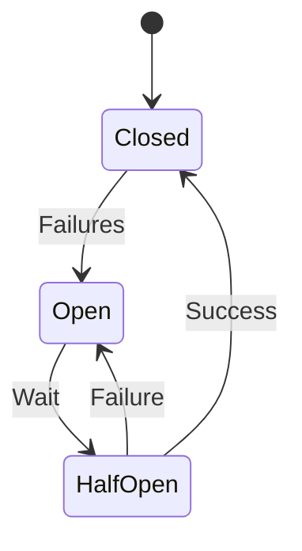

# 32. Enterprise Case Studies

> **Large-scale technology companies treat failures as normal operating conditions rather than exceptional events.**

The world's most reliable platforms are not successful because they avoid failures.

They are successful because they recover from failures automatically.

Each organization optimizes fault tolerance according to its business priorities.

---

# Amazon

## Business Problem

Amazon processes millions of:

- Product searches
- Shopping carts
- Payments
- Orders

every hour.

A failure during checkout directly impacts revenue.

---

## Fault Tolerance Strategy

Amazon designs services around:

- Cell-based architecture
- Service isolation
- Multi-AZ deployment
- Automatic failover
- Queue-based communication
- Graceful degradation

---

## Example

Recommendation Service fails.

Instead of:

```
Homepage Unavailable
```

Amazon displays:

```
Popular Products
```

Customers continue shopping.

---

## Lesson

Never allow non-critical services to stop critical business workflows.

---

# Netflix

## Business Problem

Millions of customers stream video continuously.

Stopping playback because of a single service failure is unacceptable.

---

## Fault Tolerance Strategy

Netflix employs:

- Multi-region deployment
- Chaos Engineering
- Regional isolation
- Intelligent retries
- Circuit breakers
- Adaptive streaming

---

## Example

One microservice becomes unavailable.

Other services continue functioning.

Customers may lose:

```
Recommendations
```

while

```
Video Playback Continues
```

---

## Lesson

Prioritize critical user experiences.

---

# Google

## Business Problem

Search infrastructure spans thousands of servers.

Hardware failures occur continuously.

---

## Strategy

Google assumes:

```
Servers Will Fail
```

The architecture therefore includes:

- Replication
- Consensus
- Automatic leader election
- Distributed storage
- Geographic redundancy

---

## Lesson

Design for continuous hardware failures rather than exceptional failures.

---

# Uber

## Business Problem

Ride matching requires:

- Driver location
- Customer location
- Pricing
- ETA
- Payment

Failures must not stop ride requests.

---

## Strategy

Uber uses:

- Regional isolation
- Distributed caches
- Event-driven communication
- Graceful degradation

---

## Example

ETA calculation unavailable.

Ride booking still proceeds.

ETA updates later.

---

## Lesson

Not every feature has equal business importance.

---

# Stripe

## Business Problem

Payment systems require:

- High availability
- High reliability
- Strong consistency
- Safe retries

---

## Strategy

Stripe emphasizes:

- Idempotency
- Database replication
- Retry safety
- Automatic failover

---

## Example

Payment request retried.

Duplicate charge prevented using:

```
Idempotency Key
```

---

## Lesson

Retries must never duplicate financial transactions.

---

# LinkedIn

## Business Problem

Millions of users request:

- Feed
- Messaging
- Notifications
- Search

Failures should remain localized.

---

## Strategy

LinkedIn employs:

- Service isolation
- Kafka
- Bulkheads
- Circuit breakers
- Distributed caches

---

## Lesson

Failure isolation prevents platform-wide outages.

---

# Enterprise Lessons

| Company | Primary Lesson |
|-----------|----------------|
| Amazon | Isolate critical services |
| Netflix | Validate recovery continuously |
| Google | Assume hardware fails constantly |
| Uber | Gracefully degrade non-critical features |
| Stripe | Safe retries require idempotency |
| LinkedIn | Failure isolation is essential |

---

# 33. Fault Tolerance Architecture Diagrams

## Multi-AZ Deployment

```mermaid
flowchart TD

Users

-->

Global Load Balancer

-->

AZ1

-->

Primary Database

Global Load Balancer

-->

AZ2

-->

Replica Database
```

---

## Active-Active Services

```mermaid
flowchart LR

Users

-->

Load Balancer

-->

Service A

Load Balancer

-->

Service B

Load Balancer

-->

Service C
```

---

## Active-Passive Database

```mermaid
flowchart TD

Primary

↓

Serving Requests

Replica

↓

Standby

Primary

-- Failure -->

Replica

Replica

-->

Promoted
```

---

## Circuit Breaker



---

## Retry with Backoff

```text
Request

↓

Failure

↓

Retry

1 sec

↓

Retry

2 sec

↓

Retry

4 sec

↓

Fallback
```

---

## Kubernetes Self-Healing

```text
Pod Crash

↓

Kubelet

↓

Restart

↓

Healthy Pod
```

---

# 34. Real Production War Stories

## Story 1 — Missing Timeout

An inventory service called an external warehouse API.

No timeout was configured.

When the warehouse system slowed,

application threads accumulated.

Eventually:

```
Thread Pool Exhausted

↓

Entire Application Hung
```

---

### Resolution

Implemented:

- 2-second timeout
- Circuit breaker
- Graceful degradation

---

### Lesson

Every external call requires a timeout.

---

# Story 2 — Retry Storm

Payment provider became temporarily unavailable.

Thousands of application instances retried immediately.

Traffic increased:

```
12×

Normal Load
```

The provider collapsed completely.

---

### Resolution

Introduced:

- Exponential Backoff
- Random Jitter
- Retry Budget

---

### Lesson

Retries should reduce pressure—not increase it.

---

# Story 3 — Regional Cloud Failure

One cloud region became unavailable.

Applications deployed only in one region experienced complete outages.

Recovery required:

```
Several Hours
```

---

### Resolution

Implemented:

- Multi-region deployment
- Global DNS failover
- Continuous replication

---

### Lesson

Availability Zones protect against localized failures.

Regions protect against disasters.

---

# Story 4 — Database Split-Brain

Network partition isolated database replicas.

Two primaries accepted writes simultaneously.

Result:

```
Conflicting Data
```

---

### Resolution

Introduced:

- Quorum
- Raft
- Automatic leader election

---

### Lesson

Consensus prevents split-brain scenarios.

---

# Story 5 — Kubernetes Saved Production

Hardware server failed unexpectedly.

Pods were automatically recreated on healthy nodes.

Recovery completed in:

```
45 Seconds
```

Customers never noticed.

---

### Lesson

Self-healing infrastructure significantly reduces operational effort.

---

# 35. Interview Preparation

## Beginner Questions

1. Define Fault Tolerance.
2. Difference between Fault and Failure.
3. What is Failover?
4. What is Redundancy?
5. What is Replication?
6. What is a Health Check?
7. What is a Heartbeat?
8. What is Graceful Degradation?
9. What is a Single Point of Failure?
10. Why are Timeouts important?

---

## Intermediate Questions

1. Active-Active vs Active-Passive.
2. Explain Circuit Breaker.
3. Explain Bulkhead Pattern.
4. Explain Retry Strategies.
5. Explain Idempotency.
6. Explain Quorum.
7. Explain Leader Election.
8. Explain Replica Lag.
9. Explain Kubernetes Self-Healing.
10. Explain Dead Letter Queue.

---

## Senior Architect Questions

1. Design a fault-tolerant payment platform.
2. Remove SPOFs from an e-commerce system.
3. Design automatic database failover.
4. Explain split-brain prevention.
5. Explain fault tolerance in Kubernetes.
6. Design a globally fault-tolerant architecture.
7. Explain trade-offs between consistency and availability.
8. Explain failure domains.
9. Explain chaos engineering strategy.
10. Explain enterprise recovery planning.

---

# 36. Common Interview Mistakes

| Incorrect Statement | Better Answer |
|---------------------|---------------|
| Replication equals fault tolerance | Replication also requires detection and failover |
| Retry every failure | Retry only transient failures |
| Health check means HTTP 200 | Health checks must validate critical dependencies |
| Cloud eliminates failures | Cloud platforms also fail |
| One backup is enough | Recovery procedures must be tested regularly |

---

# 37. Best Practices

## Architecture

- Eliminate Single Points of Failure.
- Design for failure from the beginning.
- Separate failure domains.
- Prefer automation over manual recovery.
- Use graceful degradation for non-critical features.

---

## Application

- Configure explicit timeouts.
- Apply retries with exponential backoff and jitter.
- Implement circuit breakers.
- Use bulkheads for resource isolation.
- Make critical operations idempotent.

---

## Infrastructure

- Deploy across multiple Availability Zones.
- Use health checks and automatic failover.
- Enable self-healing platforms.
- Validate capacity during failures.

---

## Operations

- Test failover regularly.
- Run chaos engineering experiments.
- Review every production incident.
- Measure recovery continuously.
- Keep runbooks current.

---

# 38. Related Concepts

Fault tolerance complements several architectural quality attributes.

| Concept | Relationship |
|----------|--------------|
| High Availability | Keeps services accessible. Fault tolerance ensures they continue operating during failures. |
| Reliability | Produces correct results. Fault tolerance keeps producing them during failures. |
| Scalability | Handles growth. Fault tolerance ensures growth does not amplify failures. |
| Performance | Efficient systems must also recover efficiently. |
| Resilience | Fault tolerance is a key building block of resilience. |
| Disaster Recovery | Fault tolerance minimizes disruption; disaster recovery restores operations after major disasters. |
| Observability | Monitoring enables rapid detection and recovery. |
| Security | Security incidents should not become availability incidents. |

---

# 39. Further Reading

## Books

- **Release It!** — Michael T. Nygard
- **Designing Data-Intensive Applications** — Martin Kleppmann
- **Site Reliability Engineering** — Google
- **Building Secure & Reliable Systems** — Google
- **Chaos Engineering** — Casey Rosenthal & Nora Jones

---

## Topics to Explore

- Raft Consensus Algorithm
- Paxos Consensus Algorithm
- CAP Theorem
- FLP Impossibility
- Byzantine Fault Tolerance
- Failure Detectors
- Distributed Coordination
- Chaos Engineering

---

## Official Documentation

- Kubernetes Documentation
- Resilience4j Documentation
- Apache Kafka Documentation
- AWS Well-Architected Framework – Reliability Pillar
- Azure Well-Architected Framework – Reliability
- Google Cloud Architecture Framework – Reliability

---

# 40. Revision Notes

## One-Page Summary

- Failures are inevitable in distributed systems.
- Fault tolerance focuses on continuing service despite failures.
- Detect → Isolate → Recover → Improve is the core lifecycle.
- Remove Single Points of Failure wherever practical.
- Redundancy without automatic failover is incomplete.
- Retries require timeouts, backoff, and jitter.
- Circuit breakers and bulkheads prevent cascading failures.
- Idempotency enables safe retries.
- Chaos engineering validates recovery mechanisms.
- Customer impact—not component failure—is the true measure of fault tolerance.

---

# 41. Chapter Completion Checklist

```markdown
- [x] Business problem explained
- [x] Fault Tolerance defined
- [x] Failure taxonomy covered
- [x] Fault vs Error vs Failure explained
- [x] Failure domains introduced
- [x] SPOFs identified
- [x] Detection mechanisms explained
- [x] Health checks and heartbeats covered
- [x] Timeouts and retries discussed
- [x] Redundancy and replication covered
- [x] Active-Active vs Active-Passive explained
- [x] Leader election and quorum introduced
- [x] Consensus overview included
- [x] Circuit breakers and bulkheads covered
- [x] Idempotency discussed
- [x] Kubernetes and cloud implementations explained
- [x] Trade-offs analyzed
- [x] Recovery metrics defined
- [x] Production incidents analyzed
- [x] Anti-patterns documented
- [x] Enterprise maturity model included
- [x] Architecture review checklist completed
- [x] ADR example included
- [x] Enterprise case studies added
- [x] Interview preparation included
- [x] Best practices documented
- [x] Revision notes completed
```

---

# 42. Architect's Final Principles

Before approving a production architecture, experienced architects ask:

1. What happens when this component fails?
2. Is there any Single Point of Failure?
3. Can failures propagate across services?
4. Can healthy components continue serving customers?
5. How quickly is the failure detected?
6. Is recovery automatic or manual?
7. Have failover procedures been tested?
8. Are retries safe and bounded?
9. Is customer impact minimized through graceful degradation?
10. Will this architecture continue operating during realistic production failures?

---

# Chapter Summary

Fault Tolerance is the architectural capability to **continue delivering acceptable service despite component failures**.

Rather than attempting to prevent failures entirely, fault-tolerant systems assume failures are inevitable and focus on:

- Fast detection
- Failure isolation
- Automatic recovery
- Graceful degradation
- Continuous improvement

A fault-tolerant architecture combines multiple complementary mechanisms such as:

- Health checks
- Heartbeats
- Timeouts
- Retries
- Circuit breakers
- Bulkheads
- Replication
- Automatic failover
- Consensus
- Self-healing infrastructure

The ultimate objective is not merely to keep servers running—it is to ensure **business continuity and a consistent customer experience** even when failures occur.

---

# Connection to Previous Chapters

The first five chapters establish the core quality attributes of resilient enterprise systems.

| Chapter | Primary Question |
|----------|------------------|
| **Chapter 1 – High Availability** | Can customers access the system? |
| **Chapter 2 – Reliability** | Can customers trust the results? |
| **Chapter 3 – Scalability** | Can the system grow with demand? |
| **Chapter 4 – Performance** | Can the system process work efficiently? |
| **Chapter 5 – Fault Tolerance** | Can the system continue operating when components fail? |

These chapters form the architectural foundation for the next topic:

> **Chapter 6 – Resilience**, which explores how systems **adapt, recover, learn, and become stronger after failures**, extending beyond simply tolerating them.
