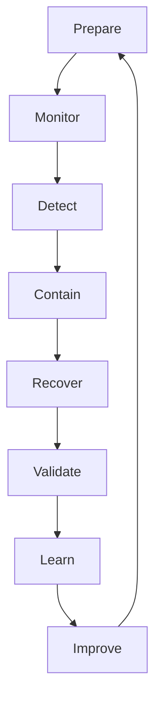
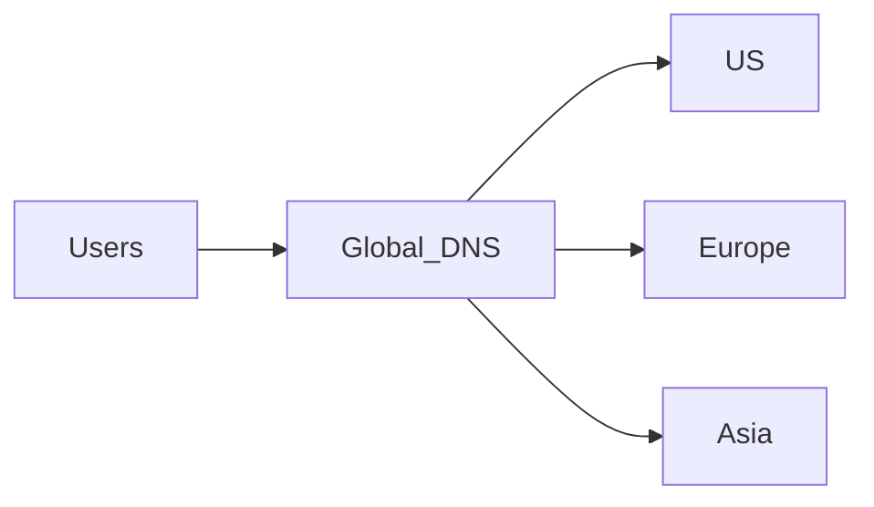
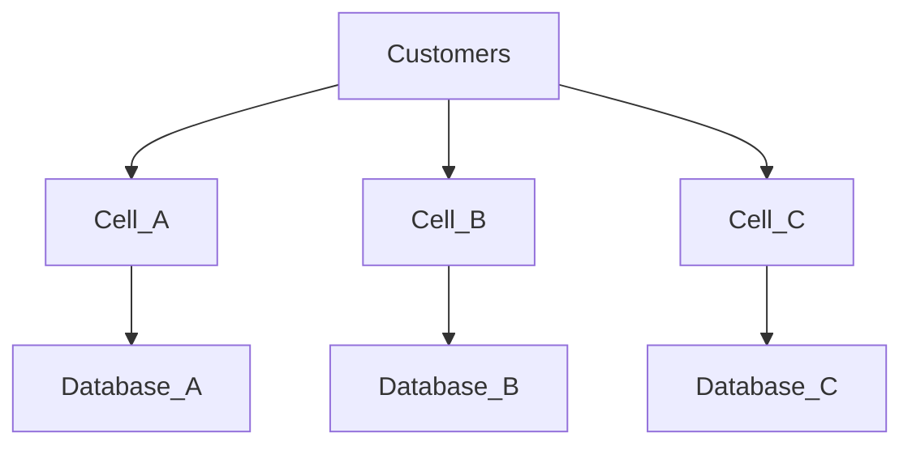

# 41. Enterprise Case Studies

> **The world's most resilient organizations do not eliminate failures—they engineer systems that continue delivering business value despite constant disruption.**

Large-scale technology companies experience failures every day.

Examples include:

- Server failures
- Disk failures
- Software bugs
- Network partitions
- Regional cloud outages
- Human mistakes

Instead of trying to eliminate failures,

they design architectures that:

- Detect failures immediately
- Limit blast radius
- Recover automatically
- Learn continuously

---

# Amazon

## Business Challenge

Amazon processes millions of:

- Product searches
- Shopping carts
- Payments
- Orders

every hour.

Checkout interruptions directly impact revenue.

---

## Resilience Strategy

Amazon uses:

- Cell-based architecture
- Multi-AZ deployment
- Service isolation
- Queue-driven communication
- Automatic failover
- Graceful degradation

---

## Example

Recommendation engine unavailable.

Instead of:

```text
Homepage Failure
```

Customers receive:

```text
Popular Products
```

Checkout continues.

---

## Lesson

Critical business workflows should remain operational even when supporting services fail.

---

# Netflix

## Business Challenge

Video streaming must continue despite infrastructure failures.

Stopping playback is unacceptable.

---

## Strategy

Netflix emphasizes:

- Chaos Engineering
- Multi-region deployment
- Circuit breakers
- Intelligent retries
- Regional isolation
- Adaptive streaming

---

## Example

Recommendation service fails.

Streaming continues.

Customers notice little or no interruption.

---

## Lesson

Prioritize the customer experience that delivers the most business value.

---

# Google

## Business Challenge

Google operates millions of servers worldwide.

Hardware failures occur continuously.

---

## Strategy

Google assumes:

```text
Hardware Will Fail
```

Architecture includes:

- Replication
- Consensus
- Automatic leader election
- Distributed storage
- Geographic redundancy

---

## Lesson

Design systems assuming continuous hardware failures rather than exceptional failures.

---

# Uber

## Business Challenge

Ride requests require:

- Driver matching
- ETA calculation
- Pricing
- Payment

Failures cannot prevent ride booking.

---

## Strategy

Uber employs:

- Event-driven architecture
- Regional isolation
- Distributed caches
- Graceful degradation

---

## Example

ETA unavailable.

Ride booking still succeeds.

ETA updates later.

---

## Lesson

Separate essential business functions from convenience features.

---

# Stripe

## Business Challenge

Financial transactions require:

- Zero duplicate charges
- High availability
- Strong consistency

---

## Strategy

Stripe emphasizes:

- Idempotency
- Database replication
- Automatic failover
- Safe retries

---

## Example

Payment retried.

Duplicate payment prevented using:

```text
Idempotency Key
```

---

## Lesson

Retries should never create duplicate financial operations.

---

# Microsoft Azure

## Business Challenge

Cloud platforms must survive:

- Hardware failures
- Regional failures
- Massive customer workloads

---

## Strategy

Azure uses:

- Availability Zones
- Regional redundancy
- Automated platform recovery
- Health monitoring
- Live migration

---

## Lesson

Infrastructure resilience enables application resilience.

---

# Enterprise Lessons

| Company | Primary Resilience Lesson |
|----------|---------------------------|
| Amazon | Isolate critical business functions |
| Netflix | Continuously validate recovery |
| Google | Assume hardware always fails |
| Uber | Degrade gracefully |
| Stripe | Safe retries through idempotency |
| Microsoft | Infrastructure automation |

---

# 42. Architecture Diagrams

## Resilience Lifecycle



---

## Multi-Region Recovery



---

## Cell Architecture



Failure remains inside one cell.

---

## Progressive Recovery

```text
Authentication

↓

Payments

↓

Orders

↓

Inventory

↓

Search

↓

Recommendations
```

Critical services recover first.

---

## Self-Healing

```text
Pod Failure

↓

Health Check

↓

Restart

↓

Healthy Pod

↓

Traffic Restored
```

---

# 43. Real Production War Stories

## Story 1 — Hidden Dependency

A shopping platform depended on an internal authentication service.

Authentication became unavailable.

Every request failed.

Although application servers remained healthy,

customers could not log in.

---

### Resolution

Implemented:

- Dependency-aware health checks
- Cached authentication tokens
- Graceful degradation

---

### Lesson

Hidden dependencies often become the largest source of outages.

---

# Story 2 — Feature Flag Saved Production

A new recommendation engine caused severe latency.

Instead of rolling back the deployment,

operations disabled the feature flag.

Application remained online.

---

### Lesson

Feature Flags separate deployment from business risk.

---

# Story 3 — Auto Scaling Failure

Traffic increased unexpectedly.

Auto Scaling thresholds were configured too aggressively.

Scaling occurred too late.

Customers experienced delays.

---

### Resolution

Implemented:

- Predictive scaling
- Better monitoring
- Capacity simulation

---

### Lesson

Recovery depends on correctly configured automation.

---

# Story 4 — Regional Disaster

Entire cloud region became unavailable.

Global DNS redirected traffic.

Healthy regions automatically scaled.

Business continued.

---

### Lesson

Regional resilience requires preparation before disasters occur.

---

# Story 5 — Chaos Engineering Prevented Outage

Routine chaos experiment revealed:

Replica promotion required manual approval.

Recovery time exceeded business objectives.

Automation added before the next production incident.

---

### Lesson

Controlled failures expose hidden weaknesses before customers do.

---

# 44. Interview Preparation

## Beginner Questions

1. Define Resilience.
2. Difference between Resilience and Fault Tolerance.
3. What is Graceful Degradation?
4. What is Self-Healing?
5. What is Blast Radius?
6. What is RTO?
7. What is RPO?
8. Why is Recovery Automation important?
9. What is Chaos Engineering?
10. Why is Monitoring critical?

---

## Intermediate Questions

1. Cell Architecture vs Shared Architecture.
2. Explain Progressive Delivery.
3. Explain Feature Flags.
4. Explain Canary Deployment.
5. Explain Blue-Green Deployment.
6. Explain Traffic Shifting.
7. Explain Adaptive Scaling.
8. Explain Error Budgets.
9. Explain Recovery Lifecycle.
10. Explain Business KPIs for Resilience.

---

## Senior Architect Questions

1. Design a resilient payment platform.
2. Design a multi-region SaaS architecture.
3. Reduce blast radius for an e-commerce platform.
4. Design recovery after a regional cloud failure.
5. Explain resilience for Kubernetes.
6. Build a continuous validation strategy.
7. Design autonomous recovery.
8. Explain resilience maturity.
9. How would you improve an existing fragile platform?
10. Explain how resilience differs from reliability and fault tolerance.

---

# 45. Common Interview Mistakes

| Incorrect Statement | Better Answer |
|---------------------|---------------|
| High Availability equals Resilience | Resilience includes recovery, adaptation, and continuous improvement |
| Backup equals resilience | Backups support recovery but do not provide resilience alone |
| Cloud automatically provides resilience | Applications must still be designed for resilience |
| Retry every failure | Retry only transient failures with limits |
| Chaos Engineering creates outages | Controlled experiments improve resilience |

---

# 46. Best Practices

## Architecture

- Design for failure from the beginning.
- Minimize blast radius.
- Automate recovery.
- Prioritize critical business workflows.
- Continuously evolve architecture.

---

## Applications

- Configure explicit timeouts.
- Use retries with exponential backoff.
- Implement graceful degradation.
- Support idempotency.
- Protect dependencies with circuit breakers.

---

## Infrastructure

- Deploy across multiple Availability Zones.
- Use Multi-Region for disaster resilience.
- Enable self-healing platforms.
- Continuously validate failover.

---

## Operations

- Maintain runbooks.
- Conduct Game Days.
- Perform Chaos Engineering.
- Measure recovery continuously.
- Learn from every incident.

---

# 47. Related Concepts

| Concept | Relationship |
|----------|--------------|
| High Availability | Keeps services reachable |
| Reliability | Produces correct results |
| Fault Tolerance | Continues operating during failures |
| Scalability | Handles growth |
| Observability | Enables detection |
| Disaster Recovery | Restores after catastrophic failures |
| Chaos Engineering | Validates resilience |
| SRE | Operational discipline supporting resilience |

---

# 48. Further Reading

## Books

- **Release It!** — Michael T. Nygard
- **Site Reliability Engineering** — Google
- **Building Secure & Reliable Systems** — Google
- **Chaos Engineering** — Casey Rosenthal & Nora Jones
- **Designing Data-Intensive Applications** — Martin Kleppmann

---

## Topics to Explore

- Chaos Engineering
- Cell Architecture
- Antifragility
- Site Reliability Engineering
- Distributed Coordination
- Service Mesh
- Autonomous Operations
- Failure Injection Testing

---

## Official References

- Kubernetes Documentation
- AWS Well-Architected Framework – Reliability Pillar
- Azure Well-Architected Framework
- Google Cloud Architecture Framework
- Resilience4j Documentation

---

# 49. Revision Notes

## One-Page Summary

- Resilience extends beyond fault tolerance.
- Prepare → Detect → Contain → Recover → Learn → Improve forms the resilience lifecycle.
- Reduce blast radius before adding redundancy.
- Graceful degradation protects business continuity.
- Self-healing reduces manual intervention.
- Continuous validation is essential.
- Chaos Engineering validates assumptions.
- Every production incident should strengthen the architecture.
- Customer impact—not infrastructure failure—is the ultimate measure of resilience.

---

# 50. Chapter Completion Checklist

```markdown
- [x] Business motivation explained
- [x] Resilience defined
- [x] Fault Tolerance comparison completed
- [x] Business impact analyzed
- [x] Failure lifecycle explained
- [x] Resilience principles covered
- [x] Architecture decisions documented
- [x] Implementation mechanisms explained
- [x] Trade-offs analyzed
- [x] Measurements defined
- [x] Production resilience covered
- [x] Anti-patterns documented
- [x] Enterprise maturity model included
- [x] Architecture review checklist completed
- [x] ADR example added
- [x] Enterprise case studies included
- [x] Architecture diagrams added
- [x] Interview preparation completed
- [x] Best practices documented
- [x] Related concepts linked
- [x] Revision notes completed
```

---

# 51. Architect's Final Principles

Before approving a production architecture, experienced architects ask:

1. What is the blast radius if this component fails?
2. Can customers continue their most critical workflows?
3. Is recovery fully automated?
4. Can the system adapt dynamically to changing conditions?
5. Are deployments progressive and reversible?
6. Have recovery procedures been tested recently?
7. Are business KPIs monitored alongside technical metrics?
8. Does every incident improve the architecture?
9. Is resilience proportional to business value?
10. Will this architecture become stronger through operational experience?

---

# Chapter Summary

Resilience is the architectural capability to **anticipate, withstand, recover from, adapt to, and continuously improve after disruptions while maintaining acceptable business outcomes**.

Unlike fault tolerance, which primarily focuses on **continuing operation during failures**, resilience spans the complete lifecycle:

```text
Prepare

↓

Detect

↓

Contain

↓

Recover

↓

Adapt

↓

Learn

↓

Improve
```

A resilient architecture combines:

- Graceful degradation
- Self-healing
- Automation
- Progressive delivery
- Multi-region deployment
- Continuous validation
- Chaos Engineering
- Observability
- Business-driven recovery priorities

The goal is not merely to survive failures.

The goal is to **recover quickly, minimize customer impact, and emerge stronger after every incident**.

---

# Connection to Previous Chapters

| Chapter | Primary Question |
|----------|------------------|
| Chapter 1 – High Availability | Can customers access the system? |
| Chapter 2 – Reliability | Can customers trust the results? |
| Chapter 3 – Scalability | Can the system grow? |
| Chapter 4 – Performance | Can the system respond efficiently? |
| Chapter 5 – Fault Tolerance | Can the system continue operating during failures? |
| **Chapter 6 – Resilience** | **Can the system recover, adapt, and continuously improve after disruptions?** |

Resilience naturally leads into the next foundational topic:

> **Chapter 7 – Consistency**, where we explore how distributed systems maintain correct and synchronized data across multiple nodes, even during failures and concurrent updates.

---

> **Chapter 6 Complete**

This concludes **Chapter 6 – Resilience**.
